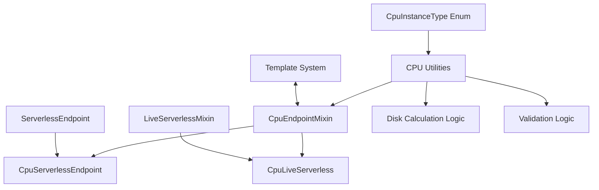
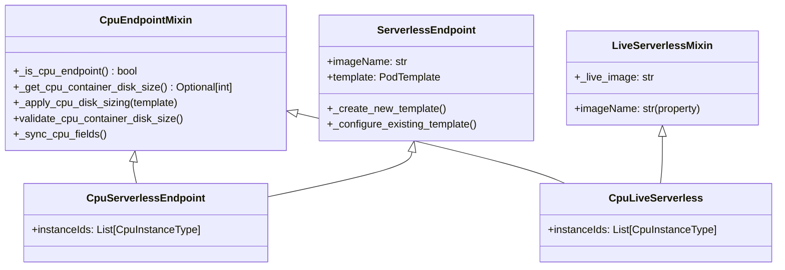

# CPU Container Disk Sizing Architecture

## Overview

This document describes the architectural design and implementation of automatic container disk sizing and validation for CPU serverless endpoints. The system prevents deployment failures by enforcing hardware-based disk limits while optimizing resource allocation.

## Problem Statement

CPU instances have specific container disk size limits based on their vCPU count and generation. Previously:
- Users could set disk sizes exceeding instance capabilities, causing deployment failures
- No automatic sizing meant inefficient resource allocation 
- Error messages provided no actionable guidance
- GPU and CPU logic was tightly coupled in a single class

## Architecture Design

### Core Components



### Class Hierarchy



## Implementation Details

### 1. CPU Disk Limits Calculation

CPU instances have predictable disk limits based on their specifications:

```python
def calculate_max_disk_size(instance_type: CpuInstanceType) -> int:
    """
    Formula:
    - CPU3G/CPU3C: vCPU count × 10GB
    - CPU5C: vCPU count × 15GB
    """
    instance_str = instance_type.value
    parts = instance_str.split("-")
    vcpu_count = int(parts[1])
    
    if instance_str.startswith("cpu5c"):
        return vcpu_count * 15  # CPU5C: 15GB per vCPU
    elif instance_str.startswith(("cpu3g", "cpu3c")):
        return vcpu_count * 10  # CPU3G/CPU3C: 10GB per vCPU
```

#### Disk Limits by Instance Type

| Instance Type | vCPU | RAM | Max Disk |
|---------------|------|-----|----------|
| CPU3G_1_4     | 1    | 4GB | 10GB     |
| CPU3G_2_8     | 2    | 8GB | 20GB     |
| CPU3G_4_16    | 4    | 16GB| 40GB     |
| CPU3G_8_32    | 8    | 32GB| 80GB     |
| CPU3C_1_2     | 1    | 2GB | 10GB     |
| CPU3C_2_4     | 2    | 4GB | 20GB     |
| CPU3C_4_8     | 4    | 8GB | 40GB     |
| CPU3C_8_16    | 8    | 16GB| 80GB     |
| CPU5C_1_2     | 1    | 2GB | 15GB     |
| CPU5C_2_4     | 2    | 4GB | 30GB     |
| CPU5C_4_8     | 4    | 8GB | 60GB     |
| CPU5C_8_16    | 8    | 16GB| 120GB    |

### 2. CpuEndpointMixin Design

The mixin provides reusable CPU functionality through composition:

```python
class CpuEndpointMixin:
    def _is_cpu_endpoint(self) -> bool:
        """Check if endpoint has CPU instances configured."""
        return (hasattr(self, "instanceIds") 
                and self.instanceIds is not None 
                and len(self.instanceIds) > 0)
    
    def _get_cpu_container_disk_size(self) -> Optional[int]:
        """Calculate minimum disk size across all CPU instances."""
        if not self._is_cpu_endpoint():
            return None
        return get_max_disk_size_for_instances(self.instanceIds)
    
    def _apply_cpu_disk_sizing(self, template: PodTemplate) -> None:
        """Auto-size template if using default disk size."""
        if not self._is_cpu_endpoint():
            return
            
        default_disk_size = PodTemplate.model_fields["containerDiskInGb"].default
        if template.containerDiskInGb == default_disk_size:
            cpu_disk_size = self._get_cpu_container_disk_size()
            if cpu_disk_size is not None:
                template.containerDiskInGb = cpu_disk_size
```

### 3. Validation Strategy

Multi-instance validation uses the minimum disk limit to ensure compatibility:

```python
def get_max_disk_size_for_instances(
    instance_types: Optional[List[CpuInstanceType]]
) -> Optional[int]:
    """Return minimum disk limit across instances for compatibility."""
    if not instance_types:
        return None
        
    disk_limits = [
        CPU_INSTANCE_DISK_LIMITS[instance_type] 
        for instance_type in instance_types
    ]
    return min(disk_limits)  # Most restrictive limit
```

Example:
```python
# Mixed instance types
instances = [CpuInstanceType.CPU3G_1_4,    # 10GB limit
            CpuInstanceType.CPU3G_2_8]     # 20GB limit
            
max_disk = get_max_disk_size_for_instances(instances)
# Returns 10GB (minimum) to ensure compatibility with all instances
```

### 4. Template Integration

The system integrates with the existing template system through lifecycle hooks:

```python
class CpuServerlessEndpoint(CpuEndpointMixin, ServerlessEndpoint):
    def _create_new_template(self) -> PodTemplate:
        """Create template with CPU-appropriate sizing."""
        template = PodTemplate(
            name=self.resource_id,
            imageName=self.imageName,
            env=KeyValuePair.from_dict(self.env or get_env_vars()),
        )
        self._apply_cpu_disk_sizing(template)  # Apply CPU sizing
        return template
    
    @model_validator(mode="after")
    def set_serverless_template(self):
        self._sync_cpu_fields()  # Set CPU-specific fields
        
        # Template creation/configuration
        if not self.templateId and not self.template:
            self.template = self._create_new_template()
        elif self.template:
            self._configure_existing_template()
            
        # Validate final configuration
        self.validate_cpu_container_disk_size()
        return self
```

## Design Decisions

### 1. Mixin Pattern Choice

**Decision**: Use mixin pattern for CPU functionality
**Rationale**: 
- Enables composition over inheritance
- Allows reuse across `CpuServerlessEndpoint` and `CpuLiveServerless`
- Maintains separation of concerns
- Avoids diamond inheritance problems

### 2. Automatic vs Manual Sizing

**Decision**: Auto-size only when using default template values
**Rationale**:
- Respects developer intent for custom sizing
- Provides sensible defaults for new users
- Avoids breaking existing configurations
- Enables gradual adoption

### 3. Validation Timing

**Decision**: Validate during model validation (after initialization)
**Rationale**:
- Catches errors early in object lifecycle
- Provides clear error messages with context
- Integrates with Pydantic validation framework
- Fails fast to prevent runtime issues

### 4. Multi-Instance Strategy

**Decision**: Use minimum disk limit across all specified instances
**Rationale**:
- Ensures template works with any of the specified instances
- Prevents deployment failures from instance selection
- Simple to understand and implement
- Conservative approach prioritizes reliability

## Error Handling

### Validation Errors

When disk size exceeds limits, the system provides actionable error messages:

```python
ValueError: Container disk size 200GB exceeds the maximum allowed for CPU instances. 
Instance limits: cpu3g-1-4: max 10GB, cpu3g-2-8: max 20GB. Maximum allowed: 10GB
```

### Error Message Components

1. **Current configuration**: Shows what was attempted
2. **Instance-specific limits**: Lists each instance and its limit
3. **Maximum allowed**: Shows the calculated limit to use
4. **Actionable guidance**: Clear path to resolution

## Usage Examples

### Basic CPU Endpoint

```python
# Automatic sizing with default instances
endpoint = CpuServerlessEndpoint(
    name="cpu-endpoint",
    imageName="my-app:latest"
)
# Uses CPU3G_2_8 by default, auto-sizes to 20GB disk

# Custom instances with auto-sizing
endpoint = CpuServerlessEndpoint(
    name="cpu-endpoint", 
    imageName="my-app:latest",
    instanceIds=[CpuInstanceType.CPU3G_1_4, CpuInstanceType.CPU5C_1_2]
)
# Auto-sizes to 10GB (minimum of 10GB and 15GB)
```

### CPU Live Serverless

```python
# CPU-only live serverless with locked image
live_endpoint = CpuLiveServerless(
    name="cpu-live-endpoint",
    instanceIds=[CpuInstanceType.CPU5C_2_4]
)
# Uses locked CPU image, auto-sizes to 30GB disk
```

### Custom Template with Validation

```python
# Custom template gets validated
template = PodTemplate(
    name="custom-template",
    imageName="my-app:v2",
    containerDiskInGb=50  # Exceeds CPU3G_1_4 limit of 10GB
)

# This will raise ValueError during validation
endpoint = CpuServerlessEndpoint(
    name="cpu-endpoint",
    template=template,
    instanceIds=[CpuInstanceType.CPU3G_1_4]
)
```

## Testing Strategy

### Unit Tests
- CPU utility functions (`calculate_max_disk_size`, `get_max_disk_size_for_instances`)
- Mixin functionality in isolation
- Edge cases and error conditions

### Integration Tests
- Cross-component interactions
- Template system integration
- Validation workflow end-to-end
- Backward compatibility verification

### Test Categories

1. **Calculation Tests**: Verify disk size formulas
2. **Auto-sizing Tests**: Template modification behavior
3. **Validation Tests**: Error detection and messages
4. **Integration Tests**: Component interaction
5. **Regression Tests**: Backward compatibility

## Conclusion

The CPU container disk sizing architecture provides:

- **Reliability**: Prevents deployment failures through validation
- **Efficiency**: Optimizes resource allocation via auto-sizing  
- **Usability**: Clear error messages and sensible defaults
- **Maintainability**: Clean separation of GPU and CPU concerns
- **Extensibility**: Patterns ready for future enhancements

The design prioritizes backward compatibility while providing a foundation for future CPU-related features and optimizations.