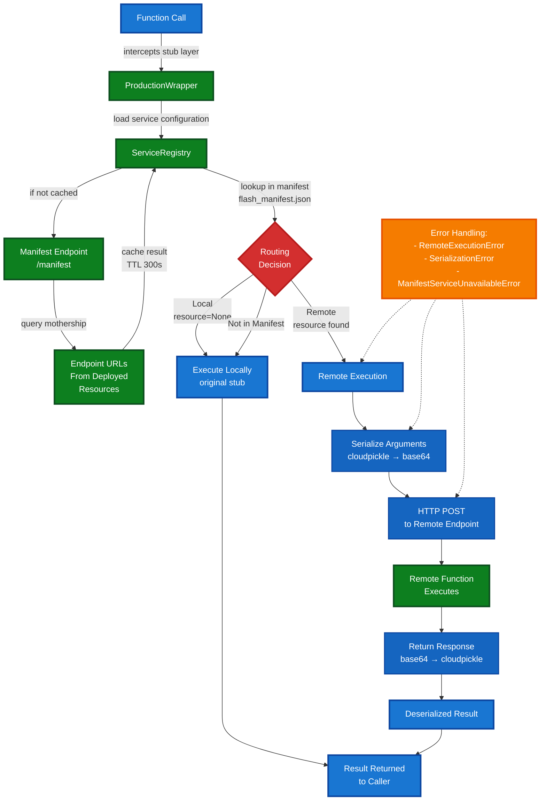
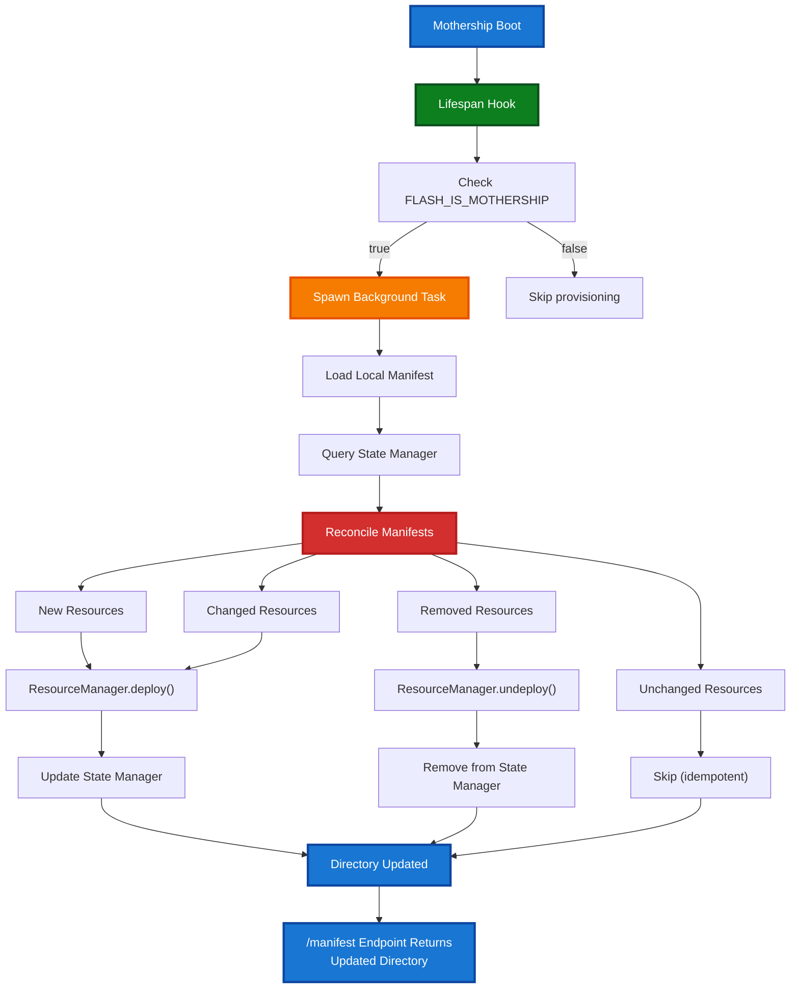

# Cross-Endpoint Routing for Serverless Functions

## Overview

Cross-endpoint routing enables serverless functions to seamlessly call functions deployed on different endpoints. Functions can execute locally or remotely based on service discovery configuration, allowing developers to build distributed applications without manual routing logic.

## Problem Statement

Previously, serverless functions were isolated to their deployment endpoint. Building distributed applications required:
- Manual HTTP calls to other endpoints with serialization boilerplate
- No unified function invocation pattern across endpoints
- Difficulty discovering which functions exist on which endpoints
- Complex error handling for remote failures
- No automatic argument serialization/deserialization

Cross-endpoint routing solves these problems by providing transparent function routing with manifest-based service discovery.

## User Guide

### Quick Start

Cross-endpoint routing works through a manifest that maps functions to resource configurations. Functions are routed automatically based on this manifest.

#### 1. Create a Manifest

Create a `flash_manifest.json` in your project root:

```json
{
  "version": "1.0",
  "project_name": "my-project",
  "function_registry": {
    "process_image": "image-processor",
    "generate_report": "report-generator"
  },
  "resources": {
    "image-processor": {
      "resource_type": "ServerlessEndpoint",
      "handler_file": "handlers/image.py",
      "functions": [
        {"name": "process_image", "module": "processors.image", "is_async": true}
      ]
    },
    "report-generator": {
      "resource_type": "ServerlessEndpoint",
      "handler_file": "handlers/report.py",
      "functions": [
        {"name": "generate_report", "module": "processors.report", "is_async": true}
      ]
    }
  }
}
```

The manifest structure:
- **`function_registry`**: Maps function names to resource configuration names
- **`resources`**: Defines resource configurations with their handler files and function details
- **Functions not in `function_registry`** execute locally on the current endpoint

#### 2. Set Environment Variables

Configure the mothership directory URL (required for remote routing):

```bash
# Required for cross-endpoint routing to work
export FLASH_MOTHERSHIP_URL=https://mothership.example.com

# Optional: Identifies the current endpoint (useful for distributed tracing)
export RUNPOD_ENDPOINT_ID=gpu_config
```

Note: Without `FLASH_MOTHERSHIP_URL`, all functions execute locally. The system gracefully falls back to local execution.

#### 3. Define Functions

Define functions normally. The routing system decides execution location:

```python
from tetra_rp import stub

@stub.function()
async def process_image(image_path: str) -> dict:
    """Process an image - may execute locally or remotely."""
    # This function might route to 'image-processor' endpoint
    # based on manifest configuration
    return {"processed": True}

@stub.function()
async def local_only_function(data: str) -> str:
    """Always executes locally (not in manifest)."""
    return f"Processed: {data}"

@stub.function()
async def generate_report(data: list) -> bytes:
    """May route to 'report-generator' endpoint."""
    return b"report data"
```

#### 4. Call Functions Normally

The routing system handles execution location transparently:

```python
# Local execution (not in manifest)
result = await local_only_function("hello")

# Remote or local execution (based on manifest)
result = await process_image("path/to/image.jpg")
```

### Configuration

#### Manifest File

The manifest file (`flash_manifest.json`) defines function routing and resource configurations:

```json
{
  "version": "1.0",
  "project_name": "my-project",
  "function_registry": {
    "function_name": "resource_config_name",
    "another_function": "another_resource"
  },
  "resources": {
    "resource_config_name": {
      "resource_type": "ServerlessEndpoint",
      "handler_file": "handlers/module.py",
      "functions": [
        {"name": "function_name", "module": "path.to.module", "is_async": true}
      ]
    }
  }
}
```

**Key Points**:
- **`function_registry`**: Maps function names to resource configuration names
- **`resources`**: Defines deployment configuration for each resource
- **Functions not listed** in `function_registry` execute locally
- Missing manifest: logs warning, all functions execute locally

**Manifest Location** (in order of precedence):
1. Path specified in `FLASH_MANIFEST_PATH` env var
2. `flash_manifest.json` in project root
3. Auto-detected in package directory

#### Environment Variables

| Variable | Required | Purpose |
|----------|----------|---------|
| `FLASH_MOTHERSHIP_URL` | Yes* | URL of mothership directory service |
| `RUNPOD_ENDPOINT_ID` | No | Current endpoint ID (for tracing) |
| `FLASH_MANIFEST_PATH` | No | Explicit path to manifest file |

*Required for remote routing; without it, all functions execute locally

### Usage Patterns

#### Pattern 1: Microservice Architecture

Split functionality across endpoints using manifest:

**Manifest (flash_manifest.json)**:
```json
{
  "version": "1.0",
  "function_registry": {
    "resize_image": "image-processor",
    "generate_metrics": "report-generator",
    "workflow": "orchestrator"
  },
  "resources": {
    "image-processor": {
      "resource_type": "ServerlessEndpoint",
      "functions": [
        {"name": "resize_image", "module": "image_module", "is_async": true}
      ]
    },
    "report-generator": {
      "resource_type": "ServerlessEndpoint",
      "functions": [
        {"name": "generate_metrics", "module": "metrics_module", "is_async": true}
      ]
    },
    "orchestrator": {
      "resource_type": "ServerlessEndpoint",
      "functions": [
        {"name": "workflow", "module": "orchestration", "is_async": true}
      ]
    }
  }
}
```

**Functions**:
```python
@stub.function()
async def resize_image(path: str, size: int) -> str:
    return process_image(path, size)

@stub.function()
async def generate_metrics(data: list) -> dict:
    return create_metrics(data)

@stub.function()
async def workflow():
    # Transparently calls across endpoints
    image = await resize_image("input.jpg", 512)
    metrics = await generate_metrics([1, 2, 3])
    return {"image": image, "metrics": metrics}
```

#### Pattern 2: Mixed Local and Remote

Configure some functions for remote execution, others local:

**Manifest**:
```json
{
  "version": "1.0",
  "function_registry": {
    "heavy_computation": "gpu-cluster"
  },
  "resources": {
    "gpu-cluster": {
      "resource_type": "ServerlessEndpoint",
      "functions": [
        {"name": "heavy_computation", "module": "gpu_module", "is_async": true}
      ]
    }
  }
}
```

**Functions**:
```python
@stub.function()
async def heavy_computation(data: bytes) -> bytes:
    # Routes to GPU cluster (in function_registry)
    return gpu_process(data)

@stub.function()
async def light_computation(value: int) -> int:
    # Always local - not in function_registry
    return value * 2
```

#### Pattern 3: Fallback to Local

Functions gracefully fall back to local execution if routing fails:

```python
@stub.function()
async def critical_service(request: dict) -> dict:
    # Routes to critical-endpoint if:
    # - In function_registry
    # - Directory available
    # Otherwise executes locally
    return handle_critical(request)

@stub.function()
async def helper_function(x: int) -> int:
    # Always local - not in manifest
    return x + 1
```

### Error Handling

#### Common Issues

**Directory Unavailable**

If `FLASH_MOTHERSHIP_URL` is not set or unreachable:
```
WARNING: FLASH_MOTHERSHIP_URL not set, directory unavailable
```

Functions default to local execution. Set the environment variable to enable routing.

**Manifest Not Found**

If manifest file cannot be found:
```
WARNING: flash_manifest.json not found. Cross-endpoint routing disabled.
```

The system logs a warning but continues—all functions execute locally. Create `flash_manifest.json` in your project root or set `FLASH_MANIFEST_PATH` to enable routing.

**Serialization Error**

If function arguments cannot be serialized:
```
SerializationError: Failed to serialize arguments: [error details]
```

Ensure arguments are picklable (cloudpickle-compatible). Avoid lambdas and local functions.

**Remote Execution Failed**

If remote endpoint fails:
```
RemoteExecutionError: Remote function execution failed: [error details]
```

Check remote endpoint logs and ensure it's deployed and healthy.

### Serialization

Arguments are serialized using cloudpickle and transmitted as base64-encoded HTTP payloads:

```python
# Simple types - always work
await process_image("path.jpg")           # str
await generate_report([1, 2, 3])          # list
await compute(data=np.array([1, 2, 3]))   # numpy array

# Complex types - work if picklable
class DataClass:
    def __init__(self, value):
        self.value = value

await process_data(DataClass(42))  # Custom class

# Won't work
async def with_lambda():
    f = lambda x: x + 1  # Can't serialize lambdas
    await remote_function(f)  # Will fail

async def with_local_func():
    def local_helper():
        return 42
    await remote_function(local_helper)  # Will fail
```

## Contributor Guide

### Architecture Overview



### Core Components

#### 1. ProductionWrapper

**Location**: `src/tetra_rp/runtime/production_wrapper.py`

Intercepts function calls at the stub layer and routes to local or remote execution:

```python
class ProductionWrapper:
    """Wrapper that routes function execution between endpoints."""

    async def wrap_function_execution(
        self,
        original_stub_func: Callable,
        func: Callable,
        dependencies: Optional[list],
        system_dependencies: Optional[list],
        accelerate_downloads: bool,
        *args: Any,
        **kwargs: Any,
    ) -> Any:
        """Route function execution to local or remote endpoint."""
        # 1. Load directory (if needed)
        await self.service_registry._ensure_directory_loaded()

        # 2. Look up function in manifest
        resource = self.service_registry.get_resource_for_function(func.__name__)

        # 3. Execute locally if not in manifest or resource is None
        if resource is None:
            return await original_stub_func(
                func,
                dependencies,
                system_dependencies,
                accelerate_downloads,
                *args,
                **kwargs
            )

        # 4. Execute remotely
        return await self._execute_remote(resource, func.__name__, args, kwargs)
```

**Routing Logic**:
- **Local**: Function not in manifest or resource=None
- **Remote**: Function in manifest with resource configuration

**Argument Serialization**:
```python
# Serialize
serialized = base64.b64encode(cloudpickle.dumps(args))

# Deserialize
args = cloudpickle.loads(base64.b64decode(serialized))
```

#### 2. ServiceRegistry

**Location**: `src/tetra_rp/runtime/service_registry.py`

Manages service discovery and manifest loading:

```python
class ServiceRegistry:
    """Service discovery and routing for cross-endpoint function calls."""

    def __init__(self, manifest_path: Optional[Path] = None):
        """Initialize with manifest and directory caching."""
        self._load_manifest(manifest_path)
        self._directory = {}  # Cached endpoint URLs from /manifest
        self._directory_lock = asyncio.Lock()
        self._directory_loaded_at = 0

    def get_resource_for_function(self, func_name: str) -> Optional[ServerlessResource]:
        """Get resource config for function from manifest."""
        # Returns None if:
        # - Function not in manifest
        # - Explicitly set to null in manifest

        # Returns ServerlessResource if mapped in manifest
        config = self._manifest["function_registry"].get(func_name)
        return self._resolve_resource(config)

    async def _ensure_directory_loaded(self) -> None:
        """Load manifest directory from mothership with caching (TTL 300s).

        Queries the /manifest endpoint on FLASH_MOTHERSHIP_URL.
        """
        if self._is_directory_fresh():
            return

        async with self._directory_lock:
            # Query mothership /manifest endpoint
            mothership_url = os.getenv("FLASH_MOTHERSHIP_URL")
            if not mothership_url:
                return  # Directory unavailable, graceful fallback

            response = await self._http_client.get(f"{mothership_url}/manifest")
            self._directory = response.json().get("manifest", {})
            self._directory_loaded_at = time.time()
```

**Manifest Format**:
```json
{
  "version": "1.0",
  "project_name": "project_name",
  "function_registry": {
    "function_name": "resource_config_name",
    "local_function": null
  },
  "resources": {
    "resource_config_name": {
      "resource_type": "ServerlessEndpoint",
      "handler_file": "handler.py",
      "functions": [...]
    }
  }
}
```

**Key fields**:
- `function_registry`: Maps function names to resource config names (null = local)
- `resources`: Defines resource configurations and their handler details

**Directory Cache**:
- TTL: 300 seconds (configurable via `DEFAULT_CACHE_TTL`)
- Thread-safe with `asyncio.Lock()`
- Graceful fallback if directory unavailable

#### 3. StateManagerClient

**Location**: `src/tetra_rp/runtime/state_manager_client.py`

HTTP client for State Manager API (used by mothership auto-provisioning):

```python
class StateManagerClient:
    """HTTP client for State Manager API.

    The State Manager persists manifest state and provides reconciliation
    for detecting new, changed, and removed resources.
    """

    async def get_persisted_manifest(
        self, mothership_id: str
    ) -> Optional[Dict[str, Any]]:
        """Fetch persisted manifest from State Manager.

        Returns:
            Manifest dict or None if not found (first boot).

        Raises:
            ManifestServiceUnavailableError: If State Manager unavailable.
        """
        # Queries {base_url}/api/v1/flash/manifests/{mothership_id}

    async def update_resource_state(
        self,
        mothership_id: str,
        resource_name: str,
        resource_data: Dict[str, Any],
    ) -> None:
        """Update resource entry in State Manager after deployment."""
        # Queries {base_url}/api/v1/flash/manifests/{mothership_id}/resources/{resource_name}
```

**Configuration**:
- Base URL: `https://api.runpod.io` (default, configurable)
- Authentication: Bearer token using RUNPOD_API_KEY env var
- HTTP timeout: 10 seconds (via `DEFAULT_REQUEST_TIMEOUT`)
- Retry logic: Exponential backoff with `DEFAULT_MAX_RETRIES` attempts (default: 3)
- Uses `httpx` library for async HTTP requests
- Raises `ImportError` if httpx not installed (with helpful message)

#### 4. Exception Hierarchy

**Location**: `src/tetra_rp/runtime/exceptions.py`

Custom exceptions for cross-endpoint routing:

```python
class FlashRuntimeError(Exception):
    """Base exception for runtime errors in cross-endpoint execution."""
    pass

class RemoteExecutionError(FlashRuntimeError):
    """Raised when remote function execution fails."""
    pass

class SerializationError(FlashRuntimeError):
    """Raised when serialization or deserialization of arguments fails."""
    pass

class ManifestError(FlashRuntimeError):
    """Raised when manifest is invalid, missing, or has unexpected structure."""
    pass

class DirectoryUnavailableError(FlashRuntimeError):
    """Raised when directory service is unavailable."""
    pass
```

**Usage**:
```python
try:
    result = await remote_execution()
except RemoteExecutionError as e:
    logger.error(f"Remote execution failed: {e}")
except SerializationError as e:
    logger.error(f"Serialization failed: {e}")
except ManifestError as e:
    logger.error(f"Manifest configuration error: {e}")
except DirectoryUnavailableError as e:
    logger.warning(f"Directory unavailable, using fallback")
```

### Integration Points

#### Stub Layer Integration

ProductionWrapper integrates with the stub execution layer in `src/tetra_rp/stubs/registry.py`:

```python
# Before: Direct stub execution
result = await original_stub_func(func, deps, ...)

# After: Routed execution
production_wrapper = ProductionWrapper(service_registry)
result = await production_wrapper.wrap_function_execution(
    original_stub_func,
    func,
    dependencies,
    system_dependencies,
    accelerate_downloads,
    *args,
    **kwargs
)
```

The wrapper is transparent - function signatures and return types are unchanged.

#### Resource Manager

Functions retrieve remote endpoint info from ResourceManager:

```python
# ServiceRegistry uses ResourceManager to find endpoint URLs
resource_manager = ResourceManager()
endpoint = resource_manager.get_resource_for_function("function_name")
endpoint_url = endpoint.url  # e.g., "https://api.runpod.io/v1/abc123"
```

### Configuration

#### Runtime Config

**Location**: `src/tetra_rp/runtime/config.py`

Centralized configuration constants:

```python
DEFAULT_CACHE_TTL = 300  # seconds
DEFAULT_HTTP_TIMEOUT = 10  # seconds
MAX_RETRY_ATTEMPTS = 3
RETRY_BACKOFF_FACTOR = 2.0
```

Add new configuration by:
1. Defining constant in `config.py`
2. Importing in component that uses it
3. Making configurable via environment variable if appropriate

### Data Flow

#### Local Execution Flow

```
Function Call
    ↓
ProductionWrapper.wrap_function_execution()
    ↓
ServiceRegistry.get_resource_for_function()
    ↓
Manifest Lookup (resource = None)
    ↓
Local Execution (original_stub_func)
    ↓
Result
```

#### Remote Execution Flow

```
Function Call
    ↓
ProductionWrapper.wrap_function_execution()
    ↓
ServiceRegistry.get_resource_for_function()
    ↓
Manifest Lookup (resource found)
    ↓
Ensure Directory Loaded
    ↓
Query /manifest Endpoint (from mothership)
    ↓
Get Remote Endpoint URL
    ↓
Serialize Arguments (cloudpickle → base64)
    ↓
HTTP POST to Remote Endpoint
    ↓
Remote Function Execution
    ↓
Deserialize Result (base64 → cloudpickle)
    ↓
Result
```

### Design Decisions

#### 1. Manifest-Based Routing

**Decision**: Use JSON manifest for function-to-resource mapping

**Rationale**:
- Decouples function code from deployment configuration
- Enables environment-specific routing without code changes
- Version control friendly
- Dynamic routing without recompilation

#### 2. Thread-Safe Async Caching

**Decision**: Use `asyncio.Lock()` for directory cache synchronization

**Rationale**:
- Prevents thundering herd on cache expiry
- Efficient - only one coroutine loads directory
- Simple to understand and maintain
- Follows async/await patterns

#### 3. Cloudpickle Serialization

**Decision**: Use cloudpickle for argument serialization

**Rationale**:
- Supports complex Python objects
- Handles closures and lambdas (when possible)
- Standard in Python ML/data processing
- Works with numpy arrays, dataframes, etc.

#### 4. Graceful Fallback

**Decision**: Default to local execution if directory unavailable

**Rationale**:
- Maintains application resilience
- Doesn't fail if mothership unreachable
- Allows local testing without directory
- Gradual degradation vs catastrophic failure

#### 5. Transparent Routing

**Decision**: Routing happens at wrapper level, not in business logic

**Rationale**:
- Function code unchanged
- Testing simplified - can mock ProductionWrapper
- Easy to add/remove routing dynamically
- No performance overhead if not needed

### Extension Points

#### Adding New Serialization Formats

To support formats other than cloudpickle:

1. Create serializer class:
```python
class JsonSerializer:
    @staticmethod
    def serialize(obj: Any) -> str:
        return json.dumps(obj)

    @staticmethod
    def deserialize(data: str) -> Any:
        return json.loads(data)
```

2. Update ProductionWrapper to select serializer based on config
3. Add tests for new format

#### Customizing Directory Loading

To support alternate directory backends instead of the mothership /manifest endpoint:

1. Subclass ServiceRegistry and override `_ensure_directory_loaded()`:
```python
class CustomDirectoryRegistry(ServiceRegistry):
    async def _ensure_directory_loaded(self) -> None:
        """Load directory from custom backend instead of /manifest."""
        if self._is_directory_fresh():
            return

        async with self._directory_lock:
            # Custom directory loading logic
            self._directory = await self._load_custom_directory()
            self._directory_loaded_at = time.time()

    async def _load_custom_directory(self) -> Dict[str, str]:
        """Load directory from custom backend."""
        # Implementation specific to backend
        return {"resource_name": "https://endpoint.url"}
```

2. Use custom registry in ProductionWrapper:
```python
registry = CustomDirectoryRegistry(manifest_path=Path("manifest.json"))
wrapper = ProductionWrapper(registry)
```

#### Adding Routing Policies

To implement routing logic beyond manifest:

1. Create policy class:
```python
class RoutingPolicy:
    async def should_route(
        self,
        func_name: str,
        resource: ServerlessResource,
        args: tuple,
        kwargs: dict
    ) -> bool:
        """Determine if function should route remotely."""
        pass
```

2. Update ProductionWrapper to use policy
3. Add configuration for policy selection

### Testing Strategy

#### Unit Tests

**ServiceRegistry Tests** (`tests/unit/runtime/test_service_registry.py`):
- Manifest loading
- Resource lookup
- Directory caching from /manifest
- TTL expiry
- Lock behavior under concurrency

**StateManagerClient Tests** (`tests/unit/runtime/test_state_manager_client.py`):
- Successful manifest fetch
- Manifest updates and deletions
- Error handling
- Retry logic with exponential backoff
- HTTP timeout handling

**MothershipProvisioner Tests** (`tests/unit/runtime/test_mothership_provisioner.py`):
- Manifest reconciliation
- Drift detection via config hashing
- Resource creation from manifest
- Directory mapping extraction

**ProductionWrapper Tests** (`tests/unit/runtime/test_production_wrapper.py`):
- Local execution routing
- Remote execution routing
- Argument serialization
- Result deserialization
- Error propagation

#### Integration Tests

**Cross-Endpoint Tests** (`tests/integration/test_cross_endpoint_routing.py`):
- End-to-end local execution
- End-to-end remote execution
- Function call across endpoints
- Error handling in real scenarios
- Directory caching behavior
- Serialization of complex objects

#### Test Patterns

```python
# Unit test: Mock dependencies
@pytest.mark.asyncio
async def test_local_execution():
    mock_registry = AsyncMock()
    mock_registry.get_resource_for_function.return_value = None

    wrapper = ProductionWrapper(mock_registry)
    result = await wrapper.wrap_function_execution(
        original_stub_func=mock_original,
        func=mock_func,
        ...
    )

    assert result == expected_result

# Integration test: Real components
@pytest.mark.asyncio
async def test_cross_endpoint_execution():
    registry = ServiceRegistry(manifest_path=manifest)
    wrapper = ProductionWrapper(registry)

    # Actual function call
    result = await wrapper.wrap_function_execution(
        original_stub_func=real_stub,
        func=test_function,
        ...
    )

    assert result == expected_result
```

### Debugging

#### Logging

Enable debug logging to trace routing decisions:

```python
import logging
logging.basicConfig(level=logging.DEBUG)

# ProductionWrapper logs routing decisions
# ServiceRegistry logs manifest and directory queries
# StateManagerClient logs State Manager API requests
```

#### Common Debug Scenarios

**Function not routing to remote**:
```python
# Check manifest
print(registry._manifest)

# Check directory (from /manifest endpoint)
print(registry._directory)

# Check resource lookup
resource = registry.get_resource_for_function("function_name")
print(f"Resource: {resource}")
```

**Serialization failures**:
```python
# Test pickling directly
import cloudpickle
try:
    cloudpickle.dumps(args)
except Exception as e:
    print(f"Not serializable: {e}")
```

**/manifest endpoint unavailable**:
```python
# Check environment variables
import os
print(f"FLASH_MOTHERSHIP_URL: {os.getenv('FLASH_MOTHERSHIP_URL')}")
print(f"RUNPOD_ENDPOINT_ID: {os.getenv('RUNPOD_ENDPOINT_ID')}")

# Check /manifest endpoint directly
import httpx
async with httpx.AsyncClient() as client:
    response = await client.get(f"{mothership_url}/manifest")
    print(response.json())
```

## Key Implementation Highlights

### Design Focus

1. **Transparent Routing**: Functions route automatically without code changes
2. **Graceful Degradation**: Defaults to local execution if directory unavailable
3. **Type Safety**: Full type hints throughout for IDE support and static analysis
4. **Thread-Safe Async**: Proper `asyncio.Lock()` usage for concurrent operations
5. **Clear Error Hierarchy**: Custom exceptions provide actionable error context

## Mothership Auto-Provisioning

### Overview

Mothership auto-provisioning automates the deployment of child endpoints when the mothership boots. Instead of manually deploying child resources, the mothership reads its `flash_manifest.json`, compares against the persisted manifest in State Manager, and automatically deploys, updates, or removes child resources as needed.

### How It Works

#### 1. Mothership Identification

When a LoadBalancerSlsResource is deployed as the mothership, the system automatically sets:
```python
env["FLASH_IS_MOTHERSHIP"] = "true"
```

This environment variable signals to the mothership that it should auto-provision child resources on boot.

#### 2. Boot Sequence

When the mothership starts:

1. **Lifespan Startup Hook**: The FastAPI lifespan context manager starts
2. **Mothership Check**: System checks if `FLASH_IS_MOTHERSHIP=true`
3. **Background Task**: Spawns non-blocking provisioning task via `asyncio.create_task()`
4. **FastAPI Server**: Starts serving requests immediately (not blocked by provisioning)
5. **Directory Available**: `/manifest` endpoint returns partial results during provisioning

#### 3. Manifest Reconciliation

The mothership compares local manifest with State Manager's persisted manifest:

**New Resources** (in local, not in State Manager):
- Created with `ResourceManager.get_or_deploy_resource()`
- `FLASH_MOTHERSHIP_URL` env var set on child
- State Manager updated with resource entry (hash, endpoint_url, status)

**Changed Resources** (different config hash):
- Updated with `ResourceManager.get_or_deploy_resource()`
- Config hash recomputed and State Manager updated

**Removed Resources** (in State Manager, not in local):
- Undeployed with `ResourceManager.undeploy_resource()`
- Removed from State Manager

**Unchanged Resources** (same config hash):
- Skipped (idempotent behavior - no unnecessary deployments)

**LoadBalancer Resources** (LoadBalancerSlsResource, LiveLoadBalancer):
- Automatically skipped (don't deploy the mothership as a child)

### Configuration

#### Environment Variables

The mothership uses:
- `RUNPOD_ENDPOINT_ID`: Mothership's endpoint ID (required for URL construction)
- `FLASH_IS_MOTHERSHIP`: Set to `"true"` to trigger auto-provisioning
- `RUNPOD_API_KEY`: Used for State Manager API authentication

#### State Manager API

The mothership persists manifest state via HTTP API:

**Endpoints**:
- `GET /api/v1/flash/manifests/{mothership_id}` - Fetch persisted manifest
- `PUT /api/v1/flash/manifests/{mothership_id}/resources/{resource_name}` - Update resource
- `DELETE /api/v1/flash/manifests/{mothership_id}/resources/{resource_name}` - Remove resource

**Base URL**: `https://api.runpod.io` (default, configurable)

**Authentication**: Bearer token using RUNPOD_API_KEY

### /manifest Endpoint

The mothership serves a `/manifest` endpoint for service discovery:

**Endpoint**: `GET /manifest`

**Response**:
```json
{
  "manifest": {
    "gpu_worker": "https://gpu-worker.api.runpod.ai",
    "cpu_worker": "https://cpu-worker.api.runpod.ai"
  }
}
```

**Behavior**:
- Queries ResourceManager for all deployed resources
- Returns partial results during provisioning (gradual population)
- Returns empty manifest if no resources deployed yet
- Graceful error handling - returns manifest and error field on failure

### Idempotency

Auto-provisioning is idempotent - running the mothership multiple times:

**First Boot**:
- All resources in local manifest are NEW
- All deployed to State Manager
- Directory populated

**Second Boot (unchanged manifest)**:
- All resources have matching config hashes
- All UNCHANGED - none deployed again
- Directory reused

**Third Boot (with changes)**:
- Changed resources updated
- New resources deployed
- Removed resources undeployed
- Unchanged resources skipped
- Efficient - only changes applied

This ensures:
- No duplicate resource deployments
- Automatic cleanup of removed resources
- Zero downtime provisioning
- Efficient use of cloud resources

### Example Workflow

```python
# main.py - Mothership application
from tetra_rp import LoadBalancerSlsResource, remote
from fastapi import FastAPI

# Create mothership
mothership = LoadBalancerSlsResource(
    name="mothership",
    imageName="my-mothership:latest"
)

# Deploy mothership (auto-provisioning triggered)
# await mothership.deploy()

# FastAPI app
app = FastAPI()

@app.get("/ping")
def ping():
    return {"status": "healthy"}

@app.get("/manifest")
async def get_manifest():
    """Auto-generated endpoint via lifespan hook"""
    # Returns directory of deployed children
    return {"manifest": {...}}
```

### Monitoring Provisioning

Check mothership logs for provisioning activity:

```
Mothership detected, initiating auto-provisioning
Mothership URL: https://mothership-123.api.runpod.ai
Reconciliation complete: 2 new, 1 changed, 1 removed, 3 unchanged
Deployed new resource: gpu_worker
Updated resource: cpu_worker
Deleted removed resource: old_worker
Provisioning complete
```

### Error Handling

Provisioning errors don't block mothership startup:

```
Failed to deploy gpu_worker: RuntimeError: GPU allocation failed
(State Manager updated with status: failed)

Failed to update cpu_worker: ConnectionError: State Manager unavailable
(Continues provisioning other resources)
```

The mothership continues serving traffic even if some child deployments fail.

### Architecture



### Implementation Files

- **StateManagerClient**: `src/tetra_rp/runtime/state_manager_client.py`
- **MothershipProvisioner**: `src/tetra_rp/runtime/mothership_provisioner.py`
- **LB Handler Generator**: `src/tetra_rp/cli/commands/build_utils/lb_handler_generator.py`
- **LoadBalancerSlsResource**: `src/tetra_rp/core/resources/load_balancer_sls_resource.py`

## Conclusion

Cross-endpoint routing provides:

- **Transparency**: Functions route automatically without manual HTTP calls
- **Flexibility**: Manifest-based routing enables environment-specific configurations
- **Resilience**: Graceful fallback to local execution if directory unavailable
- **Simplicity**: No changes to function code or signatures
- **Debuggability**: Clear error messages and logging for troubleshooting
- **Automation**: Mothership auto-provisioning eliminates manual resource deployment

The architecture prioritizes clarity and maintainability while enabling distributed serverless applications with automated deployment orchestration.
