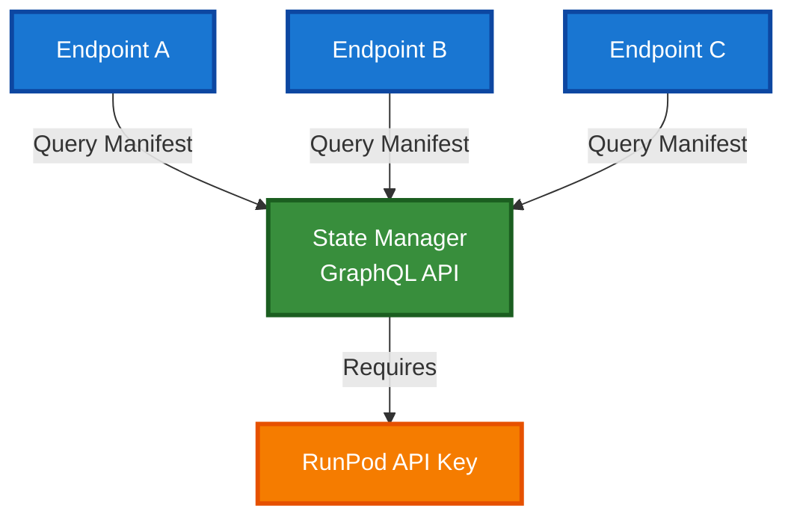

# Cross-Endpoint Routing for Serverless Functions

## Overview

Cross-endpoint routing enables serverless functions to seamlessly call functions deployed on different endpoints. Functions can execute locally or remotely based on service discovery configuration, allowing developers to build distributed applications without manual routing logic.

## Problem Statement

Previously, serverless functions were isolated to their deployment endpoint. Building distributed applications required:
- Manual HTTP calls to other endpoints with serialization boilerplate
- No unified function invocation pattern across endpoints
- Difficulty discovering which functions exist on which endpoints
- Complex error handling for remote failures
- No automatic argument serialization/deserialization

Cross-endpoint routing solves these problems by providing transparent function routing with manifest-based service discovery.

## User Guide

### Quick Start

Cross-endpoint routing works through a manifest that maps functions to resource configurations. Functions are routed automatically based on this manifest.

#### 1. Create a Manifest

Create a `flash_manifest.json` in your project root:

```json
{
  "version": "1.0",
  "project_name": "my-project",
  "function_registry": {
    "process_image": "image-processor",
    "generate_report": "report-generator"
  },
  "resources": {
    "image-processor": {
      "resource_type": "ServerlessEndpoint",
      "functions": [
        {"name": "process_image", "module": "processors.image", "is_async": true}
      ]
    },
    "report-generator": {
      "resource_type": "ServerlessEndpoint",
      "functions": [
        {"name": "generate_report", "module": "processors.report", "is_async": true}
      ]
    }
  }
}
```

The manifest structure:
- **`function_registry`**: Maps function names to resource configuration names
- **`resources`**: Defines resource configurations with their handler files and function details
- **Functions not in `function_registry`** execute locally on the current endpoint

#### 2. Set Environment Variables

Configure State Manager access for peer-to-peer routing:

```bash
# Required: API key for State Manager GraphQL access
export RUNPOD_API_KEY=your-api-key

# Optional: Identifies which resource config this endpoint represents
export FLASH_RESOURCE_NAME=gpu_config

# Optional: Fallback endpoint ID
export RUNPOD_ENDPOINT_ID=gpu-endpoint-123
```

**Architecture**: Cross-endpoint routing uses a peer-to-peer model where all endpoints query State Manager directly for service discovery. No single point of failure (no hub-and-spoke).

#### 3. Define Functions

Define functions normally. The routing system decides execution location:

```python
from runpod_flash import stub

@stub.function()
async def process_image(image_path: str) -> dict:
    """Process an image - may execute locally or remotely."""
    # This function might route to 'image-processor' endpoint
    # based on manifest configuration
    return {"processed": True}

@stub.function()
async def local_only_function(data: str) -> str:
    """Always executes locally (not in manifest)."""
    return f"Processed: {data}"

@stub.function()
async def generate_report(data: list) -> bytes:
    """May route to 'report-generator' endpoint."""
    return b"report data"
```

#### 4. Call Functions Normally

The routing system handles execution location transparently:

```python
# Local execution (not in manifest)
result = await local_only_function("hello")

# Remote or local execution (based on manifest)
result = await process_image("path/to/image.jpg")
```

### Configuration

#### Manifest File

The manifest file (`flash_manifest.json`) defines function routing and resource configurations:

```json
{
  "version": "1.0",
  "project_name": "my-project",
  "function_registry": {
    "function_name": "resource_config_name",
    "another_function": "another_resource"
  },
  "resources": {
    "resource_config_name": {
      "resource_type": "ServerlessEndpoint",
      "functions": [
        {"name": "function_name", "module": "path.to.module", "is_async": true}
      ]
    }
  }
}
```

**Key Points**:
- **`function_registry`**: Maps function names to resource configuration names
- **`resources`**: Defines deployment configuration for each resource
- **Functions not listed** in `function_registry` execute locally
- Missing manifest: logs warning, all functions execute locally

**Manifest Location** (in order of precedence):
1. Path specified in `FLASH_MANIFEST_PATH` env var
2. `flash_manifest.json` in project root
3. Auto-detected in package directory

#### Environment Variables

| Variable | Required | Purpose |
|----------|----------|---------|
| `RUNPOD_API_KEY` | Yes | State Manager GraphQL authentication |
| `FLASH_RESOURCE_NAME` | No | Resource config name for this endpoint |
| `RUNPOD_ENDPOINT_ID` | No | Fallback endpoint ID |
| `FLASH_MANIFEST_PATH` | No | Explicit path to manifest file |

### Usage Patterns

#### Pattern 1: Microservice Architecture

Split functionality across endpoints using manifest:

**Manifest (flash_manifest.json)**:
```json
{
  "version": "1.0",
  "function_registry": {
    "resize_image": "image-processor",
    "generate_metrics": "report-generator",
    "workflow": "orchestrator"
  },
  "resources": {
    "image-processor": {
      "resource_type": "ServerlessEndpoint",
      "functions": [
        {"name": "resize_image", "module": "image_module", "is_async": true}
      ]
    },
    "report-generator": {
      "resource_type": "ServerlessEndpoint",
      "functions": [
        {"name": "generate_metrics", "module": "metrics_module", "is_async": true}
      ]
    },
    "orchestrator": {
      "resource_type": "ServerlessEndpoint",
      "functions": [
        {"name": "workflow", "module": "orchestration", "is_async": true}
      ]
    }
  }
}
```

**Functions**:
```python
@stub.function()
async def resize_image(path: str, size: int) -> str:
    return process_image(path, size)

@stub.function()
async def generate_metrics(data: list) -> dict:
    return create_metrics(data)

@stub.function()
async def workflow():
    # Transparently calls across endpoints
    image = await resize_image("input.jpg", 512)
    metrics = await generate_metrics([1, 2, 3])
    return {"image": image, "metrics": metrics}
```

#### Pattern 2: Mixed Local and Remote

Configure some functions for remote execution, others local:

**Manifest**:
```json
{
  "version": "1.0",
  "function_registry": {
    "heavy_computation": "gpu-cluster"
  },
  "resources": {
    "gpu-cluster": {
      "resource_type": "ServerlessEndpoint",
      "functions": [
        {"name": "heavy_computation", "module": "gpu_module", "is_async": true}
      ]
    }
  }
}
```

**Functions**:
```python
@stub.function()
async def heavy_computation(data: bytes) -> bytes:
    # Routes to GPU cluster (in function_registry)
    return gpu_process(data)

@stub.function()
async def light_computation(value: int) -> int:
    # Always local - not in function_registry
    return value * 2
```

#### Pattern 3: Fallback to Local

Functions gracefully fall back to local execution if routing fails:

```python
@stub.function()
async def critical_service(request: dict) -> dict:
    # Routes to critical-endpoint if:
    # - In function_registry
    # - Manifest available
    # Otherwise executes locally
    return handle_critical(request)

@stub.function()
async def helper_function(x: int) -> int:
    # Always local - not in manifest
    return x + 1
```

### Error Handling

#### Common Issues

**Manifest Service Unavailable**

If `RUNPOD_API_KEY` is not set or State Manager is unreachable:
```
WARNING: State Manager unavailable, manifest service not available
```

Functions default to local execution. Set `RUNPOD_API_KEY` to enable remote routing.

**Manifest Not Found**

If manifest file cannot be found:
```
WARNING: flash_manifest.json not found. Cross-endpoint routing disabled.
```

The system logs a warning but continues—all functions execute locally. Create `flash_manifest.json` in your project root or set `FLASH_MANIFEST_PATH` to enable routing.

**Serialization Error**

If function arguments cannot be serialized:
```
SerializationError: Failed to serialize arguments: [error details]
```

Ensure arguments are picklable (cloudpickle-compatible). Avoid lambdas and local functions.

**Remote Execution Failed**

If remote endpoint fails:
```
RemoteExecutionError: Remote function execution failed: [error details]
```

Check remote endpoint logs and ensure it's deployed and healthy.

### Serialization

Arguments are serialized using cloudpickle and transmitted as base64-encoded HTTP payloads:

```python
# Simple types - always work
await process_image("path.jpg")           # str
await generate_report([1, 2, 3])          # list
await compute(data=np.array([1, 2, 3]))   # numpy array

# Complex types - work if picklable
class DataClass:
    def __init__(self, value):
        self.value = value

await process_data(DataClass(42))  # Custom class

# Won't work
async def with_lambda():
    f = lambda x: x + 1  # Can't serialize lambdas
    await remote_function(f)  # Will fail

async def with_local_func():
    def local_helper():
        return 42
    await remote_function(local_helper)  # Will fail
```

## Contributor Guide

### Architecture Overview


### Core Components

#### 1. ProductionWrapper

**Location**: `src/runpod_flash/runtime/production_wrapper.py`

Intercepts function calls at the stub layer and routes to local or remote execution:

```python
class ProductionWrapper:
    """Wrapper that routes function execution between endpoints."""

    async def wrap_function_execution(
        self,
        original_stub_func: Callable,
        func: Callable,
        dependencies: Optional[list],
        system_dependencies: Optional[list],
        accelerate_downloads: bool,
        *args: Any,
        **kwargs: Any,
    ) -> Any:
        """Route function execution to local or remote endpoint."""
        # 1. Load manifest (if needed)
        await self.service_registry._ensure_manifest_loaded()

        # 2. Look up function in manifest
        resource = self.service_registry.get_resource_for_function(func.__name__)

        # 3. Execute locally if not in manifest or resource is None
        if resource is None:
            return await original_stub_func(
                func,
                dependencies,
                system_dependencies,
                accelerate_downloads,
                *args,
                **kwargs
            )

        # 4. Execute remotely
        return await self._execute_remote(resource, func.__name__, args, kwargs)
```

**Routing Logic**:
- **Local**: Function not in manifest or resource=None
- **Remote**: Function in manifest with resource configuration

**Argument Serialization**:
```python
# Serialize
serialized = base64.b64encode(cloudpickle.dumps(args))

# Deserialize
args = cloudpickle.loads(base64.b64decode(serialized))
```

#### 2. ServiceRegistry

**Location**: `src/runpod_flash/runtime/service_registry.py`

Manages service discovery and manifest loading:

```python
class ServiceRegistry:
    """Service discovery and routing for cross-endpoint function calls."""

    def __init__(
        self,
        manifest_path: Optional[Path] = None,
        state_manager_client: Optional[StateManagerClient] = None,
        cache_ttl: int = DEFAULT_CACHE_TTL,
    ):
        """Initialize service registry.

        Args:
            manifest_path: Path to flash_manifest.json. Defaults to
                FLASH_MANIFEST_PATH env var or auto-detection.
            state_manager_client: State Manager GraphQL client for peer-to-peer discovery.
                If None, creates one from RUNPOD_API_KEY env var.
            cache_ttl: Manifest cache lifetime in seconds (default: 300).

        Environment Variables (for local vs remote detection):
            RUNPOD_API_KEY: API key for State Manager GraphQL access (peer-to-peer).
            FLASH_RESOURCE_NAME: Resource config name for this endpoint (child endpoints).
                Identifies which resource config this endpoint represents in the manifest.
            RUNPOD_ENDPOINT_ID: Endpoint ID (used as fallback for identification).
        """
        self._load_manifest(manifest_path)
        self._state_manager_client = state_manager_client or StateManagerClient()
        self._endpoint_registry = {}  # Cached endpoint URLs
        self._endpoint_registry_lock = asyncio.Lock()
        # Child endpoints use FLASH_RESOURCE_NAME to identify which resource they represent
        # Falls back to RUNPOD_ENDPOINT_ID if not set
        self._current_endpoint = os.getenv("FLASH_RESOURCE_NAME") or os.getenv(
            "RUNPOD_ENDPOINT_ID"
        )

    def get_resource_for_function(self, func_name: str) -> Optional[ServerlessResource]:
        """Get resource config for function from manifest."""
        # Returns the ServerlessResource if function is mapped in manifest
        # Returns None if function maps to current endpoint
        # Raises ValueError if function not found in manifest
        config = self._manifest.function_registry.get(func_name)
        return self._resolve_resource(config)

    async def _ensure_manifest_loaded(self) -> None:
        """Load manifest from State Manager GraphQL API if cache expired or not loaded."""
        async with self._endpoint_registry_lock:
            now = time.time()
            cache_age = now - self._endpoint_registry_loaded_at

            if cache_age > self.cache_ttl:
                # Query State Manager GraphQL API directly (peer-to-peer)
                manifest = await self._state_manager_client.get_persisted_manifest()
                self._endpoint_registry = manifest.get("resources_endpoints", {})
                self._endpoint_registry_loaded_at = now
```

**Manifest Format**:
```json
{
  "version": "1.0",
  "project_name": "project_name",
  "function_registry": {
    "function_name": "resource_config_name",
    "local_function": null
  },
  "resources": {
    "resource_config_name": {
      "resource_type": "ServerlessEndpoint",
      "functions": [...]
    }
  }
}
```

**Key fields**:
- `function_registry`: Maps function names to resource config names (null = local)
- `resources`: Defines resource configurations and their handler details

**Manifest Cache**:
- TTL: 300 seconds (configurable via `DEFAULT_CACHE_TTL`)
- Thread-safe with `asyncio.Lock()`
- Graceful fallback if manifest service unavailable

#### 3. StateManagerClient

**Location**: `src/runpod_flash/runtime/state_manager_client.py`

GraphQL client for State Manager manifest persistence (used by mothership auto-provisioning):

```python
class StateManagerClient:
    """GraphQL client for State Manager manifest persistence.

    The State Manager persists manifest state and provides reconciliation
    for detecting new, changed, and removed resources.
    """

    async def get_persisted_manifest(
        self, mothership_id: str
    ) -> Optional[Dict[str, Any]]:
        """Fetch persisted manifest from State Manager.

        Returns:
            Manifest dict or None if not found (first boot).

        Raises:
            ManifestServiceUnavailableError: If State Manager unavailable.
        """
        # Fetches environment -> active build -> manifest via RunPod GraphQL

    async def update_resource_state(
        self,
        mothership_id: str,
        resource_name: str,
        resource_data: Dict[str, Any],
    ) -> None:
        """Update resource entry in State Manager after deployment."""
        # Loads manifest via GQL, merges resource data, calls updateFlashBuildManifest
```

**Configuration**:
- Authentication: API key via `RUNPOD_API_KEY`
- GraphQL endpoint: RunPod API (via `RunpodGraphQLClient`)
- Request timeout: 10 seconds (via `DEFAULT_REQUEST_TIMEOUT`)
- Retry logic: Exponential backoff with `DEFAULT_MAX_RETRIES` attempts (default: 3)
- Fetch flow: `get_flash_environment` → `get_flash_build` → `manifest`
- Update flow: merge `resources` and call `updateFlashBuildManifest`

#### 5. Exception Hierarchy

**Location**: `src/runpod_flash/runtime/exceptions.py`

Custom exceptions for cross-endpoint routing:

```python
class FlashRuntimeError(Exception):
    """Base exception for runtime errors in cross-endpoint execution."""
    pass

class RemoteExecutionError(FlashRuntimeError):
    """Raised when remote function execution fails."""
    pass

class SerializationError(FlashRuntimeError):
    """Raised when serialization or deserialization of arguments fails."""
    pass

class ManifestError(FlashRuntimeError):
    """Raised when manifest is invalid, missing, or has unexpected structure."""
    pass

class ManifestServiceUnavailableError(FlashRuntimeError):
    """Raised when manifest service is unavailable."""
    pass
```

**Usage**:
```python
try:
    result = await remote_execution()
except RemoteExecutionError as e:
    logger.error(f"Remote execution failed: {e}")
except SerializationError as e:
    logger.error(f"Serialization failed: {e}")
except ManifestError as e:
    logger.error(f"Manifest configuration error: {e}")
except ManifestServiceUnavailableError as e:
    logger.warning(f"Manifest unavailable, using fallback")
```

### Integration Points

#### Stub Layer Integration

ProductionWrapper integrates with the stub execution layer in `src/runpod_flash/stubs/registry.py`:

```python
# Before: Direct stub execution
result = await original_stub_func(func, deps, ...)

# After: Routed execution
production_wrapper = ProductionWrapper(service_registry)
result = await production_wrapper.wrap_function_execution(
    original_stub_func,
    func,
    dependencies,
    system_dependencies,
    accelerate_downloads,
    *args,
    **kwargs
)
```

The wrapper is transparent - function signatures and return types are unchanged.

#### Resource Manager

Functions retrieve remote endpoint info from ResourceManager:

```python
# ServiceRegistry uses ResourceManager to find endpoint URLs
resource_manager = ResourceManager()
endpoint = resource_manager.get_resource_for_function("function_name")
endpoint_url = endpoint.url  # e.g., "https://api.runpod.ai/v2/abc123"
```

### Configuration

#### Runtime Config

**Location**: `src/runpod_flash/runtime/config.py`

Centralized configuration constants:

```python
DEFAULT_CACHE_TTL = 300  # seconds
DEFAULT_HTTP_TIMEOUT = 10  # seconds
MAX_RETRY_ATTEMPTS = 3
RETRY_BACKOFF_FACTOR = 2.0
```

Add new configuration by:
1. Defining constant in `config.py`
2. Importing in component that uses it
3. Making configurable via environment variable if appropriate

### Data Flow

#### Local Execution Flow


#### Remote Execution Flow


### Design Decisions

#### 1. Manifest-Based Routing

**Decision**: Use JSON manifest for function-to-resource mapping

**Rationale**:
- Decouples function code from deployment configuration
- Enables environment-specific routing without code changes
- Version control friendly
- Dynamic routing without recompilation

#### 2. Thread-Safe Async Caching

**Decision**: Use `asyncio.Lock()` for manifest cache synchronization

**Rationale**:
- Prevents thundering herd on cache expiry
- Efficient - only one coroutine loads manifest
- Simple to understand and maintain
- Follows async/await patterns

#### 3. Cloudpickle Serialization

**Decision**: Use cloudpickle for argument serialization

**Rationale**:
- Supports complex Python objects
- Handles closures and lambdas (when possible)
- Standard in Python ML/data processing
- Works with numpy arrays, dataframes, etc.

#### 4. Graceful Fallback

**Decision**: Default to local execution if State Manager unavailable

**Rationale**:
- Maintains application resilience
- Doesn't fail if State Manager temporarily unavailable
- Allows local testing without State Manager access
- Gradual degradation vs catastrophic failure

#### 5. Transparent Routing

**Decision**: Routing happens at wrapper level, not in business logic

**Rationale**:
- Function code unchanged
- Testing simplified - can mock ProductionWrapper
- Easy to add/remove routing dynamically
- No performance overhead if not needed

### Extension Points

#### Adding New Serialization Formats

To support formats other than cloudpickle:

1. Create serializer class:
```python
class JsonSerializer:
    @staticmethod
    def serialize(obj: Any) -> str:
        return json.dumps(obj)

    @staticmethod
    def deserialize(data: str) -> Any:
        return json.loads(data)
```

2. Update ProductionWrapper to select serializer based on config
3. Add tests for new format

#### Adding New Manifest Backends

To support directories other than mothership:

1. Create client class with `get_manifest()` method:
```python
class CustomManifestClient:
    async def get_manifest(self) -> Dict[str, str]:
        """Fetch manifest mapping resource_config_name → endpoint_url."""
        # Implementation specific to backend
        return {"resource_name": "https://endpoint.url"}
```

2. Update ServiceRegistry to accept and use client in constructor:
```python
registry = ServiceRegistry(
    manifest_path=Path("manifest.json"),
    manifest_client=CustomManifestClient(...)
)
```

3. Update environment variable handling if needed (CustomManifestClient can read from env vars)

#### Adding Routing Policies

To implement routing logic beyond manifest:

1. Create policy class:
```python
class RoutingPolicy:
    async def should_route(
        self,
        func_name: str,
        resource: ServerlessResource,
        args: tuple,
        kwargs: dict
    ) -> bool:
        """Determine if function should route remotely."""
        pass
```

2. Update ProductionWrapper to use policy
3. Add configuration for policy selection

### Testing Strategy

#### Unit Tests

**ServiceRegistry Tests** (`tests/unit/runtime/test_service_registry.py`):
- Manifest loading
- Resource lookup
- Manifest caching
- TTL expiry
- Lock behavior under concurrency

**ManifestClient Tests** (`tests/unit/runtime/test_manifest_client.py`):
- Successful HTTP requests
- Error handling
- Retry logic
- Timeout handling
- URL validation

**ProductionWrapper Tests** (`tests/unit/runtime/test_production_wrapper.py`):
- Local execution routing
- Remote execution routing
- Argument serialization
- Result deserialization
- Error propagation

#### Integration Tests

**Cross-Endpoint Tests** (`tests/integration/test_cross_endpoint_routing.py`):
- End-to-end local execution
- End-to-end remote execution
- Function call across endpoints
- Error handling in real scenarios
- Manifest caching behavior
- Serialization of complex objects

#### Test Patterns

```python
# Unit test: Mock dependencies
@pytest.mark.asyncio
async def test_local_execution():
    mock_registry = AsyncMock()
    mock_registry.get_resource_for_function.return_value = None

    wrapper = ProductionWrapper(mock_registry)
    result = await wrapper.wrap_function_execution(
        original_stub_func=mock_original,
        func=mock_func,
        ...
    )

    assert result == expected_result

# Integration test: Real components
@pytest.mark.asyncio
async def test_cross_endpoint_execution():
    registry = ServiceRegistry(manifest_path=manifest)
    wrapper = ProductionWrapper(registry)

    # Actual function call
    result = await wrapper.wrap_function_execution(
        original_stub_func=real_stub,
        func=test_function,
        ...
    )

    assert result == expected_result
```

### Debugging

#### Logging

Enable debug logging to trace routing decisions:

```python
import logging
logging.basicConfig(level=logging.DEBUG)

# ProductionWrapper logs
# ServiceRegistry logs
# ManifestClient logs
```

#### Common Debug Scenarios

**Function not routing to remote**:
```python
# Check manifest
print(registry._manifest)

# Check cached endpoint URLs
print(registry._endpoint_registry)

# Check resource lookup
resource = registry.get_resource_for_function("function_name")
print(f"Resource: {resource}")
```

**Serialization failures**:
```python
# Test pickling directly
import cloudpickle
try:
    cloudpickle.dumps(args)
except Exception as e:
    print(f"Not serializable: {e}")
```

**Manifest unavailable**:
```python
# Check environment variables
import os
print(f"RUNPOD_ENDPOINT_ID: {os.getenv('RUNPOD_ENDPOINT_ID')}")

# Check state manager client directly
client = StateManagerClient()
manifest = await client.get_persisted_manifest(mothership_id)
```

## Peer-to-Peer Architecture with StateManagerClient

### Overview

Cross-endpoint routing uses a **peer-to-peer architecture** where all endpoints query State Manager directly for service discovery. This eliminates single points of failure and simplifies the system architecture compared to previous hub-and-spoke models.

**Key Difference**: No mothership endpoint exposing a `/manifest` HTTP endpoint. Instead, all endpoints use `StateManagerClient` to query the RunPod GraphQL API directly.

### Architecture



### How It Works

1. **All Endpoints Equal**: Each endpoint is a peer, no master/slave relationship
2. **Direct Query**: All endpoints query State Manager GraphQL API directly
3. **No HTTP Endpoint**: No `/manifest` endpoint needed - endpoints communicate via GraphQL
4. **Caching**: ServiceRegistry caches results locally (300s TTL) to reduce State Manager load
5. **Graceful Fallback**: If State Manager unavailable, functions default to local execution

### Configuration

```bash
# Required: API key for State Manager GraphQL access
export RUNPOD_API_KEY=your-api-key-here

# Optional: Identifies which resource config this endpoint represents
export FLASH_RESOURCE_NAME=gpu_config

# Optional: Fallback endpoint ID
export RUNPOD_ENDPOINT_ID=gpu-endpoint-123
```

### StateManagerClient Features

- **GraphQL Query**: Queries RunPod GraphQL API for manifest persistence
- **Caching**: 300-second TTL cache to minimize API calls
- **Retry Logic**: Exponential backoff on failures (default 3 attempts)
- **Thread-Safe**: Uses `asyncio.Lock` for concurrent operations
- **Auto-Provisioning**: Used by mothership provisioner to update resource state

## Key Implementation Highlights

### Design Focus

1. **Transparent Routing**: Functions route automatically without code changes
2. **Graceful Degradation**: Defaults to local execution if manifest service unavailable
3. **Type Safety**: Full type hints throughout for IDE support and static analysis
4. **Thread-Safe Async**: Proper `asyncio.Lock()` usage for concurrent operations
5. **Clear Error Hierarchy**: Custom exceptions provide actionable error context

## Conclusion

Cross-endpoint routing provides:

- **Transparency**: Functions route automatically without manual HTTP calls
- **Flexibility**: Manifest-based routing enables environment-specific configurations
- **Resilience**: Graceful fallback to local execution if manifest service unavailable
- **Simplicity**: No changes to function code or signatures
- **Debuggability**: Clear error messages and logging for troubleshooting

The architecture prioritizes clarity and maintainability while enabling distributed serverless applications.
