# Flash App Deployment Architecture Specification

## Overview
A deployed Flash App consists of a Mothership coordinator and distributed Child Endpoints, where functions are partitioned across endpoints. The system uses a manifest-driven approach to route requests and coordinate execution across the distributed topology.

## Build and Deploy Flow

```mermaid
graph TD
    A["📦 flash build"] -->|"Analyze App"| B["Scan remote functions"]
    B -->|"Write"| C["flash_manifest.json"]
    B -->|"Archive"| D["artifact.tar.gz"]

    D -->|"flash deploy"| E["Push Archive +<br/>Provision Resources"]

    E -->|"CLI provisions<br/>upfront"| F["Child Endpoints<br/>Deployed"]

    G["🎯 Mothership<br/>Endpoint"] -->|"Load from<br/>.flash/"| H["Load Local<br/>Manifest"]

    H --> I["reconcile_children()"]

    I --> J["Categorize:<br/>New, Changed,<br/>Removed, Unchanged"]

    J --> K["Verify NEW<br/>Endpoints"]
    J --> L["Verify CHANGED<br/>Endpoints"]
    J --> M["Verify REMOVED<br/>Endpoints"]
    J --> N["Skip UNCHANGED<br/>Endpoints"]

    K -->|"Healthy?"| O["Update State"]
    L -->|"Healthy?"| O
    M -->|"Decommissioned?"| O

    O --> P["Persist to State Manager"]

    P --> Q["🚀 Reconciliation<br/>Complete"]

    F -.->|"Peer-to-peer<br/>Service Discovery"| R["Query State Manager<br/>GraphQL API"]

    style A fill:#1976d2,stroke:#0d47a1,stroke-width:3px,color:#fff
    style G fill:#1976d2,stroke:#0d47a1,stroke-width:3px,color:#fff
    style I fill:#f57c00,stroke:#bf360c,stroke-width:3px,color:#fff
    style K fill:#f57c00,stroke:#bf360c,stroke-width:3px,color:#fff
    style L fill:#f57c00,stroke:#bf360c,stroke-width:3px,color:#fff
    style M fill:#d32f2f,stroke:#b71c1c,stroke-width:3px,color:#fff
    style Q fill:#388e3c,stroke:#1b5e20,stroke-width:3px,color:#fff
    style R fill:#388e3c,stroke:#1b5e20,stroke-width:3px,color:#fff
    style F fill:#388e3c,stroke:#1b5e20,stroke-width:3px,color:#fff
```



## Request Routing and Execution


## Endpoint Responsibility Model

```mermaid
graph LR
    subgraph Mothership["🎯 Mothership<br/>(Coordinator)"]
        MF["Manifest Store<br/>Function Map"]
    end

    subgraph EP1["🔧 Endpoint1"]
        E1F1["funcA"]
        E1F2["funcB"]
        E1["Endpoint ID"]
    end

    subgraph EP2["🔧 Endpoint2"]
        E2F1["funcC"]
        E2F2["funcD"]
        E2["Endpoint ID"]
    end

    MF -->|"funcA, funcB → EP1"| EP1
    MF -->|"funcC, funcD → EP2"| EP2

    EP1 -.->|"Local execution"| E1F1
    E1F1 -.->|"Local execution"| E1F2
    E1F1 -.->|"Remote call"| E2F1

    style Mothership fill:#1976d2,stroke:#0d47a1,stroke-width:3px,color:#fff
    style EP1 fill:#f57c00,stroke:#bf360c,stroke-width:3px,color:#fff
    style EP2 fill:#f57c00,stroke:#bf360c,stroke-width:3px,color:#fff
    style MF fill:#1565c0,stroke:#0d47a1,stroke-width:2px,color:#fff
```



## Key Characteristics

- **Single Codebase**: All endpoints run identical code, differentiation via manifest assignments
- **Manifest-Driven**: The manifest controls function distribution and routing
- **Smart Routing**: System automatically determines if execution is local (in-process) or remote (inter-endpoint)
- **Deployed Mode**: Unlike Live mode, endpoints are aware they're in distributed deployment with explicit role assignments
- **Transparent Execution**: Functions can call other functions without knowing deployment topology; manifest handles routing
- **State Synchronization**: Mothership maintains single source of truth, synced with GQL State Manager
- **Reconciliation**: On each boot, Mothership reconciles local manifest with persisted state to deploy/update/undeploy resources
- **Peer-to-Peer Discovery**: All endpoints query State Manager GraphQL API directly for service discovery

## Actual Manifest Structure

### Build-Time Manifest (flash_manifest.json)

Generated by `flash build` command:

```json
{
  "version": "1.0",
  "generated_at": "2026-01-12T10:30:00Z",
  "project_name": "my-flash-app",
  "function_registry": {
    "funcA": "endpoint_1",
    "funcB": "endpoint_1",
    "funcC": "endpoint_2",
    "funcD": "endpoint_2"
  },
  "resources": {
    "endpoint_1": {
      "resource_type": "ServerlessResource",
      "functions": [
        {
          "name": "funcA",
          "module": "app.handlers",
          "is_async": true,
          "is_class": false
        },
        {
          "name": "funcB",
          "module": "app.handlers",
          "is_async": false,
          "is_class": false
        }
      ]
    },
    "endpoint_2": {
      "resource_type": "LoadBalancerSlsResource",
      "functions": [
        {
          "name": "funcC",
          "module": "app.api",
          "is_async": true,
          "is_class": false,
          "http_method": "POST",
          "http_path": "/api/process"
        },
        {
          "name": "funcD",
          "module": "app.api",
          "is_async": true,
          "is_class": false,
          "http_method": "GET",
          "http_path": "/api/status"
        }
      ]
    }
  },
  "routes": {
    "endpoint_2": {
      "POST /api/process": "funcC",
      "GET /api/status": "funcD"
    }
  }
}
```

### Runtime Persisted Manifest (State Manager)

Stored in State Manager with deployment metadata:

```json
{
  "version": "1.0",
  "generated_at": "2026-01-12T10:30:00Z",
  "project_name": "my-flash-app",
  "function_registry": {
    "funcA": "endpoint_1",
    "funcB": "endpoint_1",
    "funcC": "endpoint_2",
    "funcD": "endpoint_2"
  },
  "resources": {
    "endpoint_1": {
      "resource_type": "ServerlessResource",
      "functions": [...],
      "config_hash": "a1b2c3d4e5f6",
      "endpoint_url": "https://ep1-abc123.api.runpod.ai",
      "status": "deployed"
    },
    "endpoint_2": {
      "resource_type": "LoadBalancerSlsResource",
      "functions": [...],
      "config_hash": "f6e5d4c3b2a1",
      "endpoint_url": "https://ep2-def456.api.runpod.ai",
      "status": "deployed"
    }
  },
  "routes": {...}
}
```

### Persisted Manifest in State Manager

All endpoints query State Manager directly for manifest synchronization. There is no HTTP `/manifest` endpoint. Instead, endpoints use StateManagerClient to query the GraphQL API directly:

```json
{
  "version": "1.0",
  "generated_at": "2026-01-12T10:30:00Z",
  "project_name": "my-flash-app",
  "function_registry": {
    "funcA": "endpoint_1",
    "funcB": "endpoint_1",
    "funcC": "endpoint_2",
    "funcD": "endpoint_2"
  },
  "resources": {
    "endpoint_1": {
      "resource_type": "ServerlessResource",
      "functions": [...],
      "config_hash": "a1b2c3d4e5f6",
      "endpoint_url": "https://ep1-abc123.api.runpod.ai",
      "status": "deployed"
    },
    "endpoint_2": {
      "resource_type": "LoadBalancerSlsResource",
      "functions": [...],
      "config_hash": "f6e5d4c3b2a1",
      "endpoint_url": "https://ep2-def456.api.runpod.ai",
      "status": "deployed"
    }
  },
  "routes": {
    "endpoint_2": {
      "POST /api/process": "funcC",
      "GET /api/status": "funcD"
    }
  }
}
```

## Reconciliation Details

### ManifestDiff Categories

During reconciliation, resources are categorized:

- **new**: Resources in local manifest but not in persisted state → Deploy
- **changed**: Resources with different `config_hash` → Update deployment
- **removed**: Resources in persisted state but not in local manifest → Undeploy
- **unchanged**: Resources with matching `config_hash` → Skip

### State Updates

Each reconciliation action updates State Manager:

- **Deploy success**: `{config_hash, endpoint_url, status: "deployed"}`
- **Update success**: `{config_hash, endpoint_url, status: "updated"}`
- **Deploy/Update failure**: `{status: "failed", error: "error message"}`
- **Undeploy success**: Resource entry removed from State Manager

## Environment Variables

### Mothership
- `FLASH_IS_MOTHERSHIP=true` - Identifies this endpoint as mothership
- `RUNPOD_API_KEY` - For State Manager authentication
- `FLASH_MANIFEST_PATH` - Optional explicit path to manifest

### Child Endpoints
- `RUNPOD_API_KEY` - For State Manager GraphQL access (peer-to-peer service discovery)
- `FLASH_RESOURCE_NAME` - Which resource config this endpoint represents
- `RUNPOD_ENDPOINT_ID` - This child's endpoint ID
