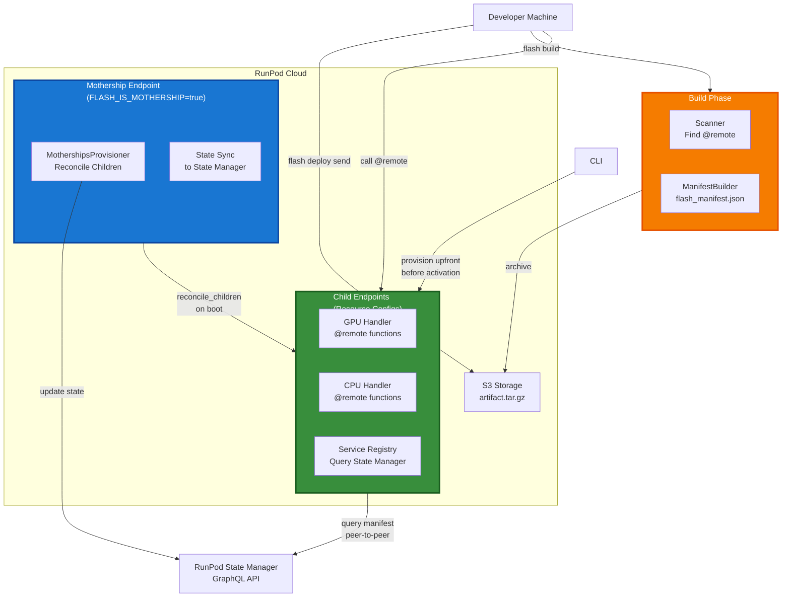
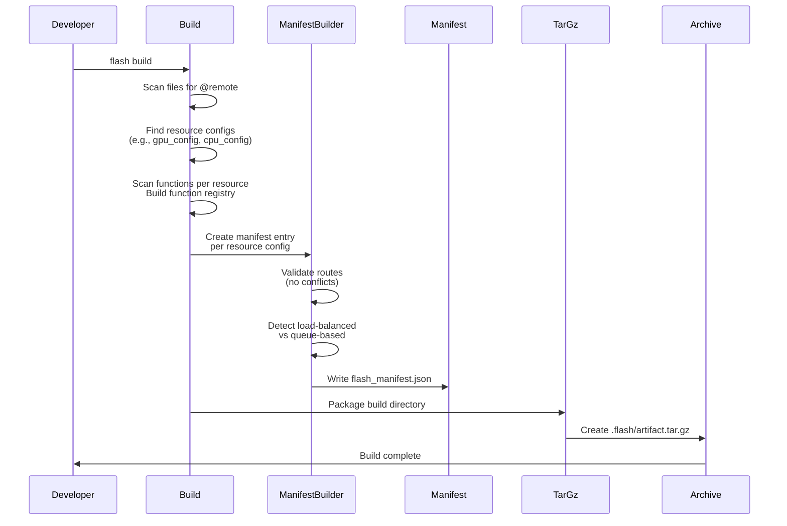
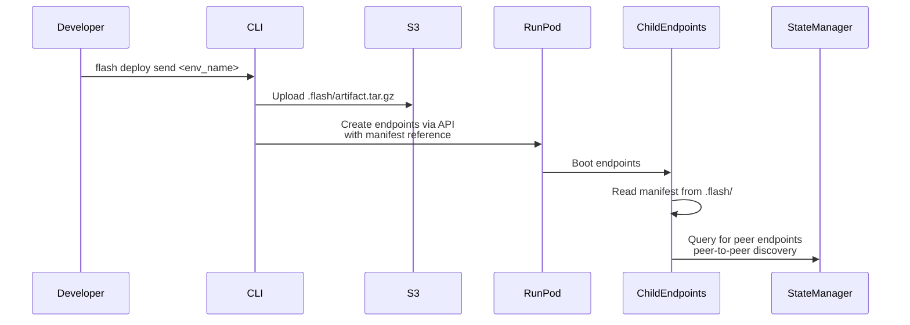
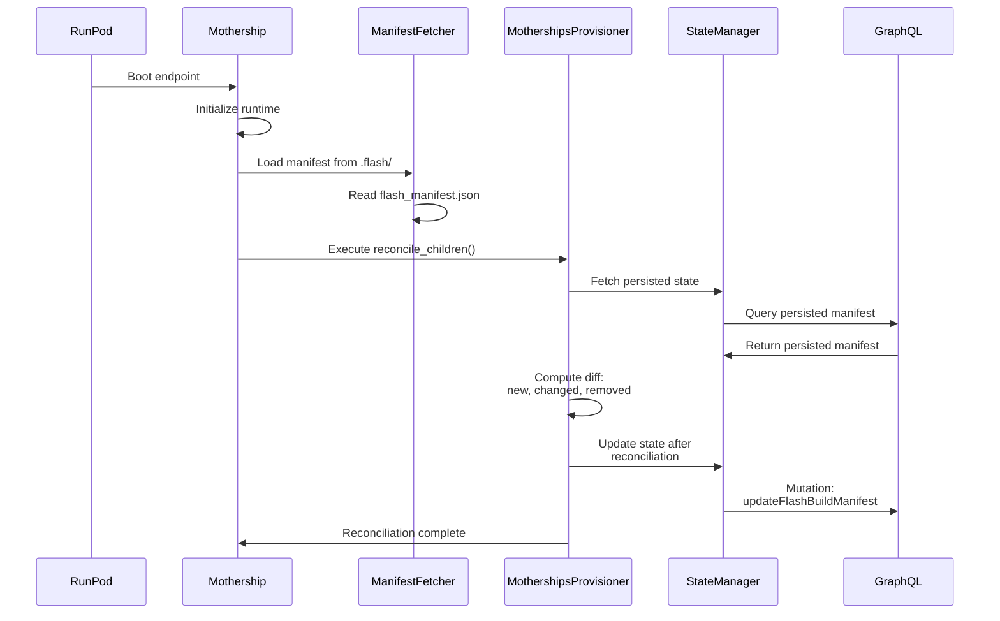
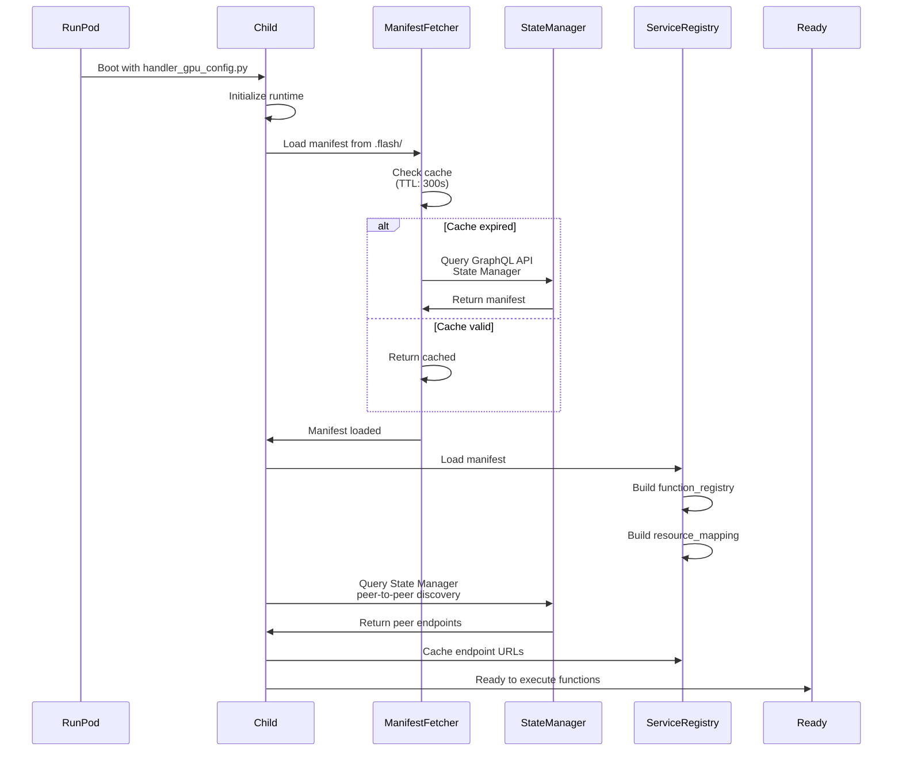
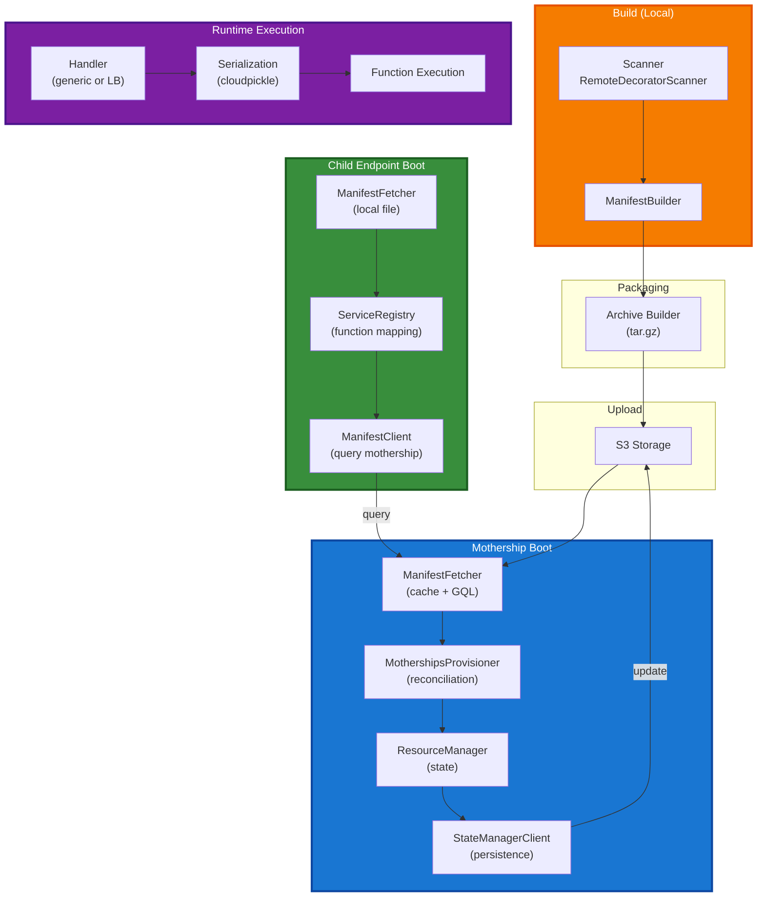

# Flash Deploy Guide

## Overview

Flash Deploy is a distributed runtime system that enables scalable execution of `@remote` functions across dynamically provisioned RunPod serverless endpoints. It bridges the gap between local development and production cloud deployment through a unified interface.

### System Goals

1. **Transparency**: Developers write local Python, deploy to cloud without code changes
2. **Scalability**: Functions execute on remote serverless endpoints with resource isolation
3. **Flexibility**: Support both queue-based and load-balanced execution models
4. **Reliability**: Automatic resource provisioning, state reconciliation, and drift detection

### High-Level Architecture



### Key Concepts

**Mothership**: The orchestration endpoint responsible for deployment, resource provisioning, and manifest distribution. Created via `flash deploy new <env_name>`.

**Child Endpoints**: Worker endpoints that execute `@remote` functions. One per resource config (e.g., `gpu_config`, `cpu_config`).

**Manifest**: JSON document describing all deployed functions, their resource configs, routing rules, and metadata. Built at compile-time, distributed to all endpoints.

**Resource Config**: A Python object that defines CloudResource specifications (GPU type, memory, image, etc.). Becomes a deployable endpoint.

**Service Registry**: Runtime component that maps function names to endpoint URLs and determines local vs remote execution.

---

## CLI Commands Reference

### flash deploy new

Create a new deployment environment (mothership).

```bash
flash deploy new <env_name> [--app-name <app_name>]
```

**Arguments:**
- `env_name`: Name for the deployment environment

**Options:**
- `--app-name <app_name>`: Flash app name (auto-detected if not provided)
- `--require-auth`: Require auth on load-balanced endpoints (omit `FLASH_DISABLE_RP_AUTH`)

**What it does:**
1. Creates a FlashApp in RunPod (if first environment for the app)
2. Creates FlashEnvironment with the specified name
3. Provisions a mothership serverless endpoint

**Example:**
```bash
flash deploy new production
# Output: Environment 'production' created successfully
# Environment ID: flash-prod-abc123
# Next: flash deploy send production
```

**Implementation:** `src/runpod_flash/cli/commands/deploy.py:38-50`

---

### flash deploy send

Deploy built archive to an environment.

```bash
flash deploy send <env_name> [--app-name <app_name>]
```

**Arguments:**
- `env_name`: Name of the deployment environment

**Options:**
- `--app-name <app_name>`: Flash app name (auto-detected if not provided)

**Prerequisites:**
- Archive must exist at `.flash/artifact.tar.gz` (created by `flash build`)

**What it does:**
1. Uploads artifact.tar.gz to S3
2. Provisions all resources upfront before environment activation
3. Manifest is read from `.flash/` directory on resources

**Example:**
```bash
flash deploy send production
# Output: 🚀 Deploying to 'production'...
# Deployment Complete
```

**Implementation:** `src/runpod_flash/cli/commands/deploy.py:197-224`

---

### flash deploy list

List all deployment environments for an app.

```bash
flash deploy list [--app-name <app_name>]
```

**Options:**
- `--app-name <app_name>`: Flash app name (auto-detected if not provided)

**Output:** Table showing:
- Environment name
- Environment ID
- Active build ID
- Creation timestamp

**Implementation:** `src/runpod_flash/cli/commands/deploy.py:27-135`

---

### flash deploy info

Show detailed information about a deployment environment.

```bash
flash deploy info <env_name> [--app-name <app_name>]
```

**Arguments:**
- `env_name`: Name of the deployment environment

**Options:**
- `--app-name <app_name>`: Flash app name (auto-detected if not provided)

**Output:** Displays:
- Environment status and ID
- Active build ID
- Associated endpoints
- Associated network volumes

**Implementation:** `src/runpod_flash/cli/commands/deploy.py:69-111`

---

### flash deploy delete

Delete a deployment environment.

```bash
flash deploy delete <env_name> [--app-name <app_name>]
```

**Arguments:**
- `env_name`: Name of the deployment environment

**Options:**
- `--app-name <app_name>`: Flash app name (auto-detected if not provided)

**Safety:**
- Requires confirmation (twice for safety)
- Cannot be undone

**Implementation:** `src/runpod_flash/cli/commands/deploy.py:237-270`

---

## Complete Deployment Flow

This section walks through the entire journey from source code to executing remote functions.

### Phase 1: Build (Local Development)



**Scanner** (`src/runpod_flash/cli/commands/build_utils/scanner.py`):
- Decorators scanned: `@remote`, `@load_balanced`, `@cluster`
- Extracts: function name, module path, async status, HTTP routing info
- Groups functions by resource config

**Manifest Building** (`src/runpod_flash/cli/commands/build_utils/manifest.py`):
- Structure:
  ```json
  {
    "version": "1.0",
    "generated_at": "2024-01-21T10:00:00Z",
    "project_name": "my_project",
    "resources": {
      "gpu_config": {
        "resource_type": "LiveServerless",
        "functions": [{"name": "process", "module": "main", ...}],
        "is_load_balanced": false
      }
    },
    "function_registry": {"process": "gpu_config"},
    "routes": {}
  }
  ```

**Archive Structure**:
```
artifact.tar.gz
├── flash_manifest.json          # Manifest (source of truth)
├── src/                         # Application source code
└── vendor/                      # Bundled dependencies
```

**Key Files:**
- `src/runpod_flash/cli/commands/build.py` - Entry point for `flash build`
- `src/runpod_flash/cli/commands/build_utils/manifest.py` - ManifestBuilder

---

### Phase 2: Deploy to Environment



**Upload Process** (`src/runpod_flash/cli/commands/deploy.py:197-224`):
1. Archive uploaded to RunPod's built-in S3 storage
2. URL generated with temporary access
3. URL passed to mothership endpoint creation

**Key Files:**
- `src/runpod_flash/cli/commands/deploy.py` - Deploy CLI commands

---

### Phase 3: Mothership Boot & Reconciliation

The mothership runs on each boot to perform reconcile_children() - reconciling desired state (manifest) with current state (local resources). Note: All resources are provisioned upfront by the CLI before environment activation.



**Key Components:**

**MothershipsProvisioner** (`src/runpod_flash/runtime/mothership_provisioner.py`):
- `is_mothership()`: Check if endpoint is mothership (FLASH_IS_MOTHERSHIP=true)
- `reconcile_children()`: Compute diff between desired and current state
- Verifies child endpoints are deployed and healthy
- Updates State Manager with reconciliation results

**ResourceManager** (`src/runpod_flash/core/resources/resource_manager.py`):
- Singleton pattern (global resource registry)
- Stores state in `.runpod/resources.pkl` with file locking
- Tracks config hashes for drift detection (hash comparison)
- Provisioned upfront by CLI before environment activation
- Auto-migrates legacy resources

**StateManagerClient** (`src/runpod_flash/runtime/state_manager_client.py`):
- GraphQL client for persisting manifest state
- Read-modify-write pattern for updates (3 GQL roundtrips)
- Thread-safe with asyncio.Lock for concurrent updates
- Retries with exponential backoff (3 attempts)

**Reconciliation Logic**:
1. **Fetch persisted manifest**: Query State Manager for previous reconciliation state
2. **Compare with current manifest**: Detect new, changed, and removed resources
3. **Verify new resources**: Check that new endpoints are deployed and healthy
4. **Verify changed resources**: Check if hash differs, verify endpoint health
5. **Verify removed resources**: Check that deleted endpoints are decommissioned
6. **Persist new state**: Update State Manager with current reconciliation results

**Key Files:**
- `src/runpod_flash/runtime/mothership_provisioner.py` - Reconciliation logic
- `src/runpod_flash/core/resources/resource_manager.py` - Resource provisioning
- `src/runpod_flash/runtime/state_manager_client.py` - State persistence

---

### Phase 4: Child Endpoint Initialization

Each child endpoint boots independently and prepares for function execution.



**ManifestFetcher** (`src/runpod_flash/runtime/manifest_fetcher.py`):
- Caches manifest with TTL (default: 300s)
- Fetches from State Manager GraphQL API (source of truth)
- Falls back to local flash_manifest.json if API unavailable
- Updates local file with fetched data
- Thread-safe with asyncio.Lock

**ServiceRegistry** (`src/runpod_flash/runtime/service_registry.py`):
- Loads manifest to build function registry
- Queries State Manager for peer endpoint URLs via GraphQL (peer-to-peer)
- Returns mapping: `{resource_config_name: endpoint_url}`
- Determines local vs remote function calls:
  - Local: Function's resource config matches FLASH_RESOURCE_NAME env var
  - Remote: Query State Manager for peer endpoint URL

**Key Environment Variables**:
- `FLASH_RESOURCE_NAME`: This endpoint's resource config name (e.g., "gpu_config")
- `RUNPOD_API_KEY`: API key for State Manager GraphQL access (peer-to-peer discovery)
- `FLASH_MANIFEST_PATH`: Optional override for manifest location
- `RUNPOD_ENDPOINT_ID`: This endpoint's RunPod endpoint ID

**Key Files:**
- `src/runpod_flash/runtime/manifest_fetcher.py` - Manifest loading with caching
- `src/runpod_flash/runtime/service_registry.py` - Service discovery
- `src/runpod_flash/runtime/generic_handler.py` - Handler utilities

---

### Phase 5: Runtime Function Execution

When client calls `@remote function`:


**Serialization** (`src/runpod_flash/runtime/serialization.py`):
- **Args/Kwargs**: cloudpickle → base64
- **Result**: cloudpickle → base64
- Max payload size: 10MB

**Handler Routing**:

**Queue-Based** (`src/runpod_flash/runtime/generic_handler.py`):

Uses a factory function `create_handler(function_registry)` that returns a RunPod-compatible handler:

```python
def handler(job: Dict[str, Any]) -> Dict[str, Any]:
    """RunPod serverless handler.

    Args:
        job: RunPod job dict with 'input' key

    Returns:
        Response dict with 'success', 'result'/'error' keys
    """
    job_input = job.get("input", {})
    function_name = job_input.get("function_name")
    execution_type = job_input.get("execution_type", "function")

    # Look up and execute function/class
    func_or_class = function_registry[function_name]
    args, kwargs = deserialize_arguments(job_input)
    result = execute_function(func_or_class, args, kwargs, execution_type, job_input)

    return {
        "success": True,
        "result": serialize_result(result),
    }
```

**Load-Balanced** (`src/runpod_flash/runtime/lb_handler.py`):
- FastAPI app with user-defined HTTP routes
- `/execute` endpoint for @remote execution (LiveLoadBalancer only)
- User routes: HTTP methods + paths from manifest

**Key Files:**
- `src/runpod_flash/runtime/generic_handler.py` - Queue-based handler
- `src/runpod_flash/runtime/lb_handler.py` - Load-balanced handler factory
- `src/runpod_flash/runtime/serialization.py` - cloudpickle serialization
- `src/runpod_flash/runtime/service_registry.py` - Cross-endpoint routing

---

## Manifest System

The manifest is the contract between build-time and runtime. It defines all deployable functions, their resource configs, and routing rules.

### Build-Time: Generation

**Location**: Generated during `flash build`

**Builder**: `ManifestBuilder` in `src/runpod_flash/cli/commands/build_utils/manifest.py`

**Input**:
- List of discovered `@remote` functions (from scanner)
- Each function has:
  - Name, module, async status
  - Resource config name
  - HTTP routing info (for load-balanced)

**Output Structure**:
```json
{
  "version": "1.0",
  "generated_at": "2024-01-21T10:00:00.000Z",
  "project_name": "my_app",
  "resources": {
    "gpu_config": {
      "resource_type": "LiveServerless",
      "functions": [
        {
          "name": "train",
          "module": "ml.training",
          "is_async": false,
          "is_class": false,
          "is_load_balanced": false,
          "is_live_resource": false,
          "config_variable": "gpu_config"
        }
      ],
      "is_load_balanced": false,
      "is_live_resource": false,
      "config_variable": "gpu_config"
    }
  },
  "function_registry": {
    "train": "gpu_config"
  },
  "routes": {}
}
```

**Validation**:
- No duplicate function names across resources
- No duplicate routes (method + path conflicts)
- Load-balanced endpoints have method and path
- No reserved paths (/execute, /ping)

**Code Reference**: `src/runpod_flash/cli/commands/build_utils/manifest.py:50-164`

---

### Runtime: Distribution & Caching

**Mothership Side** - `ManifestFetcher`:

1. **Check cache**: Is manifest cached and TTL valid?
   - Cache TTL: 300 seconds (configurable)
   - Thread-safe with asyncio.Lock

2. **Fetch from source**: If cache expired
   - Primary: RunPod GraphQL API (via RunpodGraphQLClient)
   - Fallback: Local flash_manifest.json file

3. **Update local file**: Persist fetched manifest
   - Allows recovery if API unavailable

4. **Return to caller**: Cached manifest

**Code Reference**: `src/runpod_flash/runtime/manifest_fetcher.py:47-118`

**Child Endpoint Side** - `ServiceRegistry`:

1. **Load manifest**: From local file
   - Searches multiple locations (cwd, module dir, etc)
   - Fallback to empty manifest if not found

2. **Build function registry**: Map function_name → resource_config
   - Used to determine local vs remote execution

3. **Query State Manager**: Get endpoint URLs via GraphQL
   - Queries RunPod State Manager GraphQL API directly
   - Returns: Resource endpoints for all deployed child endpoints
   - Retries with exponential backoff

4. **Cache endpoints**: Store for routing decisions

**Code Reference**: `src/runpod_flash/runtime/service_registry.py:29-80`

---

### State Persistence: StateManagerClient

The State Manager persists manifest state in RunPod's infrastructure, enabling:
- Cross-boot reconciliation tracking
- Peer-to-peer service discovery
- Manifest synchronization across endpoints

**Architecture**:
```
Client Update Request
        ↓
StateManagerClient (with asyncio.Lock)
        ↓
Read: Query GraphQL for activeBuildId
        ↓
Fetch: Get current manifest from build
        ↓
Modify: Merge changes into manifest
        ↓
Write: Mutation updateFlashBuildManifest
```

**GraphQL Operations**:
- Query: `getFlashEnvironment(flashEnvironmentId) → activeBuildId`
- Query: `getFlashBuild(buildId) → manifest`
- Mutation: `updateFlashBuildManifest(buildId, manifest)`

**Thread Safety**:
- `asyncio.Lock` serializes read-modify-write
- Prevents race conditions during concurrent resource updates
- Max retries: 3 (default), with exponential backoff

**Performance**: Each update = 3 GQL roundtrips
- Consider batching when provisioning many resources

**Code Reference**: `src/runpod_flash/runtime/state_manager_client.py:53-248`

---

## Resource Provisioning

Resources are dynamically provisioned by the mothership during boot, based on the manifest.

### ResourceManager: Local State

**Singleton Pattern**: Global resource registry, one per process

**Persistent Storage**: `.runpod/resources.pkl`
- Format: `(Dict[str, DeployableResource], Dict[str, str])` (resources, config_hashes)
- Concurrent access protected by file locking (cross-platform)
- Pickled with cloudpickle for serialization

**Operations**:

**Load**: Read persisted resources on initialization
- Shared lock (non-exclusive) for concurrent reads
- Auto-migrates from legacy hash-based keys to name-based keys

**Save**: Persist state to disk
- Exclusive lock for writing
- Atomic write to prevent corruption

**Drift Detection**: Config hash comparison
- Each resource has `config_hash` (computed from resource config)
- Stored hash vs current hash:
  - Match: Resource unchanged, skip update
  - Mismatch: Resource modified, trigger update

**Auto-Migration**: Legacy format conversion
- Old format: `{resource_id_hash: resource}`
- New format: `{ResourceType:name: resource}`
- Enables name-based lookup and drift detection

**Code Reference**: `src/runpod_flash/core/resources/resource_manager.py:22-150`

---

### Deployment Orchestration

**MothershipsProvisioner** reconciles manifest with local state:

```python
# 1. Load manifest from flash_manifest.json
manifest = load_manifest()

# 2. Fetch persisted state from State Manager
persisted = await StateManagerClient.get_persisted_manifest(mothership_id)

# 3. Compute diff
diff = compute_manifest_diff(manifest, persisted)
# diff.new: Resources to deploy
# diff.changed: Resources to update (hash differs)
# diff.removed: Resources to delete

# 4. Deploy resources (parallel, max 3 concurrent)
for resource_config in diff.new:
    deploy_resource(resource_config)

# 5. Update changed resources
for resource_config in diff.changed:
    update_resource(resource_config)

# 6. Remove deleted resources
for resource_config in diff.removed:
    delete_resource(resource_config)

# 7. Persist new state
await StateManagerClient.update_resource_state(mothership_id, resources)
```

**Parallel Deployment**:
- Max concurrent: 3 (configurable)
- Reduces boot time for deployments with many resources

**Hash-Based Drift Detection**:
- Stored hash (from previous boot) vs current hash (computed from config)
- If hashes differ: Resource has been modified, trigger update
- Prevents unnecessary updates when resource unchanged

**Code Reference**: `src/runpod_flash/runtime/mothership_provisioner.py:1-150`

---

## Remote Execution

When `@remote function` is called, the client determines whether to execute locally or remotely.

### Execution Modes

**Queue-Based (Serverless Hub)**:
- No HTTP routing
- Single handler function: `handle(job_input)`
- Input serialized in payload
- Example: `LiveServerless` resource

**Load-Balanced (FastAPI)**:
- HTTP routing with user-defined routes
- `/execute` endpoint for framework use
- State Manager GraphQL for peer-to-peer service discovery
- Example: `LiveLoadBalancer` resource

### FunctionRequest/FunctionResponse Protocol

**Request** (JSON):
```json
{
  "function": "train",
  "args": ["base64_cloudpickle_args"],
  "kwargs": {"base64": "cloudpickle_kwargs"},
  "timeout": 3600
}
```

**Response** (JSON):
```json
{
  "result": "base64_cloudpickle_result",
  "error": null,
  "status": "completed"
}
```

### Serialization

**Engine**: cloudpickle (handles lambdas, closures, custom classes)

**Encoding**: base64 (JSON-safe)

**Max Size**: 10MB (enforced at serialization)

**Process**:
```python
# Serialize
import cloudpickle, base64
serialized = base64.b64encode(cloudpickle.dumps(args))

# Deserialize
deserialized = cloudpickle.loads(base64.b64decode(serialized))
```

**Code Reference**: `src/runpod_flash/runtime/serialization.py`

---

### Handler Runtime

**Generic Handler** (Queue-Based):

Uses a factory function `create_handler(function_registry)` that creates a RunPod-compatible handler:

```python
# src/runpod_flash/runtime/generic_handler.py - conceptual flow
def handler(job: Dict[str, Any]) -> Dict[str, Any]:
    # Extract job input
    job_input = job.get("input", {})

    # Extract function name and execution type
    function_name = job_input.get("function_name")
    execution_type = job_input.get("execution_type", "function")

    # Deserialize arguments from base64-encoded cloudpickle
    args, kwargs = deserialize_arguments(job_input)

    # Lookup and execute function/class from registry
    func_or_class = function_registry[function_name]
    result = execute_function(func_or_class, args, kwargs, execution_type, job_input)

    # Serialize result to base64-encoded cloudpickle
    return {
        "success": True,
        "result": serialize_result(result),
    }
```

**Load-Balanced Handler** (FastAPI):

Uses `create_lb_handler(route_registry, include_execute=False)` factory:

```python
# src/runpod_flash/runtime/lb_handler.py - conceptual structure
app = FastAPI()

# User-defined routes registered from route_registry
for (method, path), handler_func in route_registry.items():
    app.add_api_route(path, handler_func, methods=[method])

# Framework /execute endpoint (LiveLoadBalancer only)
@app.post("/execute")
async def execute_remote_function(request: Request) -> Dict[str, Any]:
    body = await request.json()

    # Extract function metadata
    function_name = body.get("function_name")
    function_code = body.get("function_code")

    # Deserialize arguments
    args = deserialize_args(body.get("args", []))
    kwargs = deserialize_kwargs(body.get("kwargs", {}))

    # Execute function code in isolated namespace
    namespace = {}
    exec(function_code, namespace)
    func = namespace[function_name]
    result = func(*args, **kwargs)

    # Return serialized result
    return {
        "success": True,
        "result": serialize_result(result),
    }

```

**Code References**:
- `src/runpod_flash/runtime/generic_handler.py` - Queue-based handler
- `src/runpod_flash/runtime/lb_handler.py` - Load-balanced handler

---

### Cross-Endpoint Routing

**ServiceRegistry** determines function endpoint:

```python
# src/runpod_flash/runtime/service_registry.py
registry = ServiceRegistry()

# Lookup function's resource config
resource_config_name = registry.function_to_resource(function_name)

# Check if local or remote
local_resource_name = os.getenv("FLASH_RESOURCE_NAME")
if resource_config_name == local_resource_name:
    # Local: execute directly
    return execute_locally(function_name, args, kwargs)
else:
    # Remote: fetch endpoint URL
    endpoint_url = registry.get_endpoint_url(resource_config_name)
    return execute_remotely(endpoint_url, function_name, args, kwargs)
```

**Endpoint URL Caching**:
- Queries State Manager GraphQL API directly (peer-to-peer)
- Caches with TTL (default: 300s)
- Retries with exponential backoff if query fails

---

## Architecture Diagrams

### System Component Diagram



---

### Manifest Lifecycle

```mermaid
graph LR
    A["Build Time<br/>ManifestBuilder"] -->|Generate| B["flash_manifest.json<br/>(embedded in archive)"]
    B -->|Upload| C["S3<br/>(artifact.tar.gz)"]
    C -->|Provision upfront<br/>before activation| D["Child Endpoints<br/>(deployed)"]
    D -->|Extract from<br/>.flash/ directory| E["LocalManifest<br/>(from archive)"]
    Mothership -->|Load from<br/>.flash/| E
    E -->|Build registry| F["ServiceRegistry<br/>(function mapping)"]
    F -->|Query State Manager<br/>peer-to-peer| G["StateManager<br/>(GraphQL API)"]
    G -->|Return endpoints| F
    F -->|Route calls| H["Handler<br/>(execute)"]
    Mothership -->|reconcile_children<br/>on boot| D

    style A fill:#f57c00,stroke:#e65100,stroke-width:2px,color:#fff
    style B fill:#ff6f00,stroke:#e65100,stroke-width:2px,color:#fff
    style C fill:#ff6f00,stroke:#e65100,stroke-width:2px,color:#fff
    style D fill:#1976d2,stroke:#0d47a1,stroke-width:2px,color:#fff
    style E fill:#388e3c,stroke:#1b5e20,stroke-width:2px,color:#fff
    style F fill:#388e3c,stroke:#1b5e20,stroke-width:2px,color:#fff
    style G fill:#0d47a1,stroke:#051c66,stroke-width:2px,color:#fff
    style H fill:#388e3c,stroke:#1b5e20,stroke-width:2px,color:#fff
    style Mothership fill:#1976d2,stroke:#0d47a1,stroke-width:2px,color:#fff
```



---

### Resource Provisioning State Machine


---

## Environment Variables Reference

### Mothership Configuration

**FLASH_IS_MOTHERSHIP** (Required on mothership)
- Value: `"true"`
- Enables mothership auto-provisioning logic
- Triggers manifest reconciliation on boot

**RUNPOD_ENDPOINT_ID** (Required on mothership)
- RunPod serverless endpoint ID
- Used to construct mothership URL: `https://{RUNPOD_ENDPOINT_ID}.api.runpod.ai`
- Set automatically by RunPod platform

**RUNPOD_API_KEY** (Required for State Manager)
- RunPod API authentication token
- Used by StateManagerClient for GraphQL queries
- Enables manifest persistence

### Child Endpoint Configuration

**FLASH_RESOURCE_NAME** (Required on child endpoints)
- Resource config name (e.g., "gpu_config", "cpu_config")
- Identifies which resource config this endpoint represents
- Used by ServiceRegistry for local vs remote detection

**RUNPOD_API_KEY** (Required for peer-to-peer discovery)
- API key for State Manager GraphQL access
- Enables endpoints to query manifest peer-to-peer
- Used by all endpoints for service discovery

**FLASH_MANIFEST_PATH** (Optional)
- Override default manifest file location
- If not set, searches: cwd, module dir, parent dirs
- Useful for testing or non-standard layouts

### Runtime Configuration

**RUNPOD_ENDPOINT_ID** (Set by RunPod)
- This endpoint's ID
- Used for logging and identification

**FLASH_DISABLE_RP_AUTH** (Optional, load-balanced endpoints)
- Value: `"true"` to disable RunPod auth requirement
- Set by `flash deploy send` by default for LB endpoints
- Use `--require-auth` to omit this env var

---

## State Management

Flash Deploy uses a dual-layer state system for reliability and consistency.

### Local State: `.runpod/resources.pkl`

**Purpose**: Fast resource lookup within endpoint

**Format**:
```python
(
    resources: Dict[str, DeployableResource],  # Name → Resource object
    config_hashes: Dict[str, str]              # Name → Config hash
)
```

**Lifecycle**:
1. **Load**: On initialization, read from disk (shared lock)
2. **Modify**: Add/update/remove resources in memory
3. **Save**: Write to disk (exclusive lock)
4. **Persist**: File survives endpoint restarts

**Concurrency**:
- Cross-platform file locking (fcntl on Unix, msvcrt on Windows)
- Shared lock for reads (multiple concurrent readers)
- Exclusive lock for writes (single writer)
- Prevents data corruption during concurrent access

**Code Reference**: `src/runpod_flash/core/resources/resource_manager.py:46-150`

### Remote State: RunPod State Manager (GraphQL API)

**Purpose**: Persist deployment state across mothership boots

**Data Model**:
```graphql
type FlashEnvironment {
  id: ID!
  name: String!
  activeBuildId: ID
}

type FlashBuild {
  id: ID!
  manifest: JSON!  # Manifest with resource state
}
```

**Resource Entry** (in manifest):
```json
{
  "resource_name": {
    "endpoint_id": "gpu-worker-abc123",
    "endpoint_url": "https://gpu-worker-abc123.api.runpod.ai",
    "config_hash": "sha256_hash_of_config",
    "status": "running",
    "deployed_at": "2024-01-21T10:00:00Z"
  }
}
```

**Update Pattern** (Thread-Safe):
```python
async with state_manager_lock:
    # 1. Fetch current state
    build_id = await client.get_flash_environment(env_id)
    manifest = await client.get_flash_build(build_id)

    # 2. Modify state
    manifest["resources"][resource_name] = new_resource_data

    # 3. Write back atomically
    await client.update_build_manifest(build_id, manifest)
```

**Reconciliation**:
On mothership boot:
1. Load local manifest from .flash/ (desired state)
2. Fetch persisted manifest from State Manager (previous reconciliation state)
3. Compare → detect new, changed, removed resources
4. Verify resource health and status
5. Persist reconciliation state to State Manager

**Code Reference**: `src/runpod_flash/runtime/state_manager_client.py`

---

## Testing & Debugging

### flash build --preview

Local testing of your distributed system without deploying to RunPod.

```bash
flash build --preview
```

**What it does**:
1. Builds your project (creates archive, manifest)
2. Creates a Docker network for inter-container communication
3. Starts one Docker container per resource config:
   - Mothership container (orchestrator)
   - All worker containers (GPU, CPU, etc.)
4. Exposes mothership on `localhost:8000`
5. All containers communicate via Docker DNS
6. Auto-cleanup on exit (Ctrl+C)

**Use Cases**:
- Validate manifest structure before deployment
- Test resource provisioning logic
- Debug distributed function calls
- Test endpoint auto-discovery
- Verify container networking

**Code Reference**: `src/runpod_flash/cli/commands/preview.py`

### Local Docker Testing

For testing complete deployment flow locally:

```bash
# Build project
flash build

# Start local mothership simulator
docker run -it \
  -e FLASH_IS_MOTHERSHIP=true \
  -e RUNPOD_API_KEY=$RUNPOD_API_KEY \
  -v $(pwd)/.flash:/workspace/.flash \
  runpod-flash:latest

# Run provisioner
python -m runpod_flash.runtime.mothership_provisioner
```

### Debugging Tips

**Enable Debug Logging**:
```python
import logging
logging.basicConfig(level=logging.DEBUG)
```

**Inspect Manifest**:
```bash
python -c "import json; print(json.dumps(json.load(open('flash_manifest.json')), indent=2))"
```

**Check Local Resources**:
```python
from runpod_flash.core.resources.resource_manager import ResourceManager
rm = ResourceManager()
print(rm._resources)
print(rm._resource_configs)
```

**Trace Remote Calls**:
```python
# Add logging to ServiceRegistry
import logging
logging.getLogger("runpod_flash.runtime.service_registry").setLevel(logging.DEBUG)
```

---

## Key Files Reference

### CLI

| File | Purpose |
|------|---------|
| `src/runpod_flash/cli/commands/deploy.py` | Deploy environment management commands |
| `src/runpod_flash/cli/commands/build.py` | Build packaging and archive creation |
| `src/runpod_flash/cli/commands/test_mothership.py` | Local mothership testing |

### Build System

| File | Purpose |
|------|---------|
| `src/runpod_flash/cli/commands/build_utils/scanner.py` | Scans for @remote decorators |
| `src/runpod_flash/cli/commands/build_utils/manifest.py` | Manifest builder and validation |

### Resource Management

| File | Purpose |
|------|---------|
| `src/runpod_flash/core/resources/resource_manager.py` | Resource provisioning and state tracking |
| `src/runpod_flash/core/resources/base.py` | Base resource types |
| `src/runpod_flash/core/resources/serverless.py` | Serverless resource implementations |

### Runtime: Manifest & State

| File | Purpose |
|------|---------|
| `src/runpod_flash/runtime/manifest_fetcher.py` | Manifest loading from local .flash/ directory |
| `src/runpod_flash/runtime/state_manager_client.py` | GraphQL client for peer-to-peer service discovery |
| `src/runpod_flash/runtime/mothership_provisioner.py` | Auto-provisioning logic |

### Runtime: Execution

| File | Purpose |
|------|---------|
| `src/runpod_flash/runtime/generic_handler.py` | Queue-based handler factory |
| `src/runpod_flash/runtime/lb_handler.py` | Load-balanced (FastAPI) handler factory |
| `src/runpod_flash/runtime/service_registry.py` | Service discovery and routing |
| `src/runpod_flash/runtime/serialization.py` | cloudpickle serialization/deserialization |

### Utilities

| File | Purpose |
|------|---------|
| `src/runpod_flash/core/utils/file_lock.py` | Cross-platform file locking |
| `src/runpod_flash/core/utils/singleton.py` | Singleton pattern implementation |
| `src/runpod_flash/runtime/config.py` | Runtime configuration constants |

---

## Common Issues & Solutions

### Issue: Manifest not found on child endpoint

**Cause**: flash_manifest.json not included in archive or not found at runtime

**Solution**:
1. Verify archive contains flash_manifest.json: `tar -tzf artifact.tar.gz | grep manifest`
2. Check `FLASH_MANIFEST_PATH` env var if using custom location
3. Ensure flash_manifest.json is in build root when creating archive

### Issue: Resource provisioning fails with hash mismatch

**Cause**: Resource config changed between boots, but hash wasn't updated

**Solution**:
1. ResourceManager auto-refreshes hashes on init
2. Delete `.runpod/resources.pkl` to force reset
3. Check if resource config changes are intentional (then hash should differ)

### Issue: Remote function calls fail with endpoint not found

**Cause**: ServiceRegistry unable to query mothership or manifest outdated

**Solution**:
1. Verify `RUNPOD_API_KEY` environment variable is set
2. Check State Manager GraphQL API is accessible
3. Verify manifest includes the resource config: `grep resource_name flash_manifest.json`
4. Check that child endpoints are deployed and healthy

### Issue: Manifest cache staleness

**Cause**: Manifest updated but cache still valid (TTL)

**Solution**:
1. Default TTL: 300 seconds
2. Clear cache manually: `ManifestFetcher().invalidate_cache()`
3. Reduce TTL in production if frequent updates needed (trade-off: more API calls)

---

## Performance Considerations

### Manifest Fetching

- **Cache TTL**: Default 300s
- **API calls**: Only on cache miss
- **Fallback**: Local file (no network)
- **Optimization**: Increase TTL for stable deployments

### State Manager Updates

- **GraphQL calls**: 3 per resource update (fetch env, fetch build, update build)
- **Locking**: Serializes concurrent updates
- **Recommendation**: Batch updates when provisioning many resources

### Serialization

- **Engine**: cloudpickle (slower than pickle for complex objects)
- **Encoding**: base64 (JSON-safe, ~33% overhead)
- **Max size**: 10MB enforced
- **Tip**: Break large function calls into batches

### Resource Provisioning

- **Parallel deployment**: Max 3 concurrent (configurable)
- **Retries**: 3 attempts with exponential backoff
- **Boot time**: Scales with number of resources (parallel helps)
- **Persistent state**: Enables fast boot recovery if partially failed

---

## Contributing

When modifying Flash Deploy, ensure:

1. **Manifest schema backward compatibility**: Don't break existing manifest loading
2. **State file format**: Document any changes to `.runpod/resources.pkl` format
3. **Environment variables**: Document all new env vars in this guide
4. **Tests**: Add tests for new provisioning logic
5. **Documentation**: Update this guide for new features
