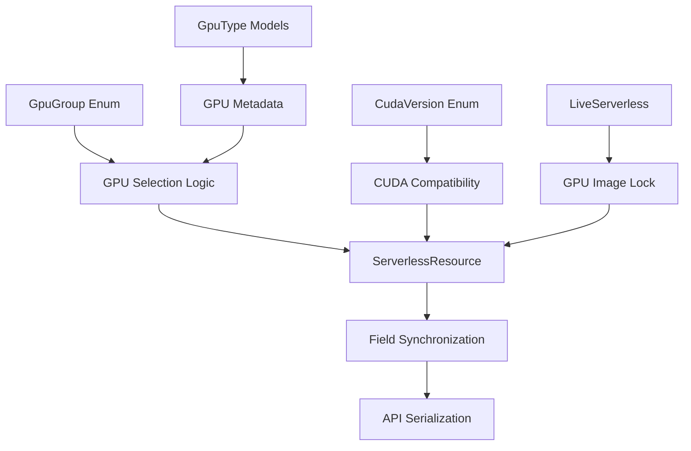
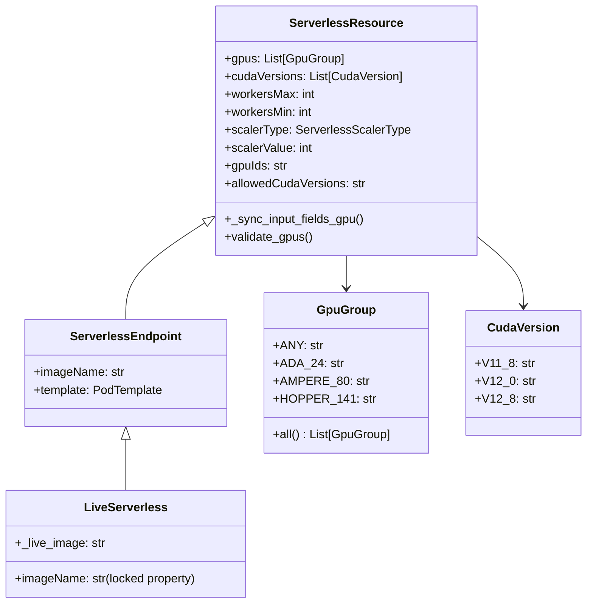
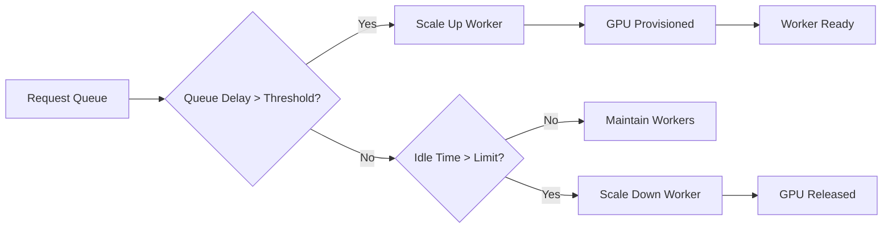

# GPU Provisioning Architecture

## Overview

This document describes the architectural design and implementation of GPU provisioning for serverless endpoints. The system manages GPU resource allocation, CUDA version compatibility, and GPU group selection through a flexible and extensible design.

## Problem Statement

GPU provisioning requires sophisticated resource management:
- Multiple GPU types with different capabilities and memory configurations
- CUDA version compatibility across different GPU architectures  
- Dynamic GPU group selection and availability
- Integration with cloud provider GPU inventory
- Pricing optimization and resource allocation

## Architecture Design

### Core Components



### Class Hierarchy



## Implementation Details

### 1. Worker-Based GPU Scaling

GPU provisioning is primarily managed through a worker scaling model rather than direct GPU allocation:

```python
class ServerlessResource(DeployableResource):
    # Worker scaling configuration
    workersMax: Optional[int] = 3          # Maximum concurrent workers
    workersMin: Optional[int] = 0          # Minimum active workers  
    scalerType: Optional[ServerlessScalerType] = ServerlessScalerType.QUEUE_DELAY
    scalerValue: Optional[int] = 4         # Scaling threshold
    
    # GPU configuration per worker
    gpus: Optional[List[GpuGroup]] = [GpuGroup.ANY]
    cudaVersions: Optional[List[CudaVersion]] = []
```

#### Scaling Strategies

| Scaler Type | Description | Scaling Trigger |
|------------|-------------|-----------------|
| `QUEUE_DELAY` | Scale based on request queue delay | `scalerValue` seconds of queue time |
| `REQUEST_COUNT` | Scale based on request volume | `scalerValue` requests per time window |

#### Worker Lifecycle



### 2. GPU Group Classification

GPU groups are organized by architecture, memory, and performance tier:

```python
class GpuGroup(Enum):
    ANY = "any"
    
    # Ada Lovelace Architecture
    ADA_24 = "ADA_24"        # NVIDIA GeForce RTX 4090
    ADA_32_PRO = "ADA_32_PRO"    # NVIDIA GeForce RTX 5090
    ADA_48_PRO = "ADA_48_PRO"    # NVIDIA RTX 6000 Ada, L40, L40S
    ADA_80_PRO = "ADA_80_PRO"    # NVIDIA H100 variants
    
    # Ampere Architecture
    AMPERE_16 = "AMPERE_16"   # RTX A4000, A4500, RTX 4000 Ada
    AMPERE_24 = "AMPERE_24"   # RTX A5000, L4, RTX 3090
    AMPERE_48 = "AMPERE_48"   # A40, RTX A6000
    AMPERE_80 = "AMPERE_80"   # A100 80GB variants
    
    # Hopper Architecture
    HOPPER_141 = "HOPPER_141" # NVIDIA H200
```

#### GPU Group Specifications

| Group | Architecture | Memory | Examples | Use Cases |
|-------|-------------|--------|----------|-----------|
| ADA_24 | Ada Lovelace | 24GB | RTX 4090 | Gaming workloads, ML inference |
| ADA_32_PRO | Ada Lovelace | 32GB | RTX 5090 | Professional graphics, training |
| ADA_48_PRO | Ada Lovelace | 48GB | L40, L40S | AI training, rendering |
| ADA_80_PRO | Ada Lovelace | 80GB | H100 PCIe | Large model training |
| AMPERE_16 | Ampere | 16GB | RTX A4000 | Development, small models |
| AMPERE_24 | Ampere | 24GB | RTX 3090 | Research, mid-size training |
| AMPERE_48 | Ampere | 48GB | A40 | Professional ML workloads |
| AMPERE_80 | Ampere | 80GB | A100 | Large-scale training |
| HOPPER_141 | Hopper | 141GB | H200 | Cutting-edge AI research |

### 2. CUDA Version Management

CUDA compatibility is managed through version enums:

```python
class CudaVersion(Enum):
    V11_8 = "11.8"
    V12_0 = "12.0"
    V12_1 = "12.1"
    V12_2 = "12.2"
    V12_3 = "12.3"
    V12_4 = "12.4"
    V12_5 = "12.5"
    V12_6 = "12.6"
    V12_7 = "12.7"
    V12_8 = "12.8"
```

#### CUDA Compatibility Matrix

| GPU Architecture | Supported CUDA Versions | Recommended |
|------------------|-------------------------|-------------|
| Ampere | 11.8+ | 12.0+ |
| Ada Lovelace | 11.8+ | 12.1+ |
| Hopper | 12.0+ | 12.4+ |

### 3. GPU Selection and Validation

The system implements intelligent GPU selection:

```python
@field_validator("gpus")
@classmethod
def validate_gpus(cls, value: List[GpuGroup]) -> List[GpuGroup]:
    """Expand ANY to all available GPU groups."""
    if value == [GpuGroup.ANY]:
        return GpuGroup.all()  # Returns all specific GPU groups
    return value

@classmethod  
def all(cls) -> List["GpuGroup"]:
    """Returns all GPU groups except ANY."""
    return [cls.AMPERE_48] + [g for g in cls if g != cls.ANY]
```

### 4. Field Synchronization System

GPU provisioning uses a dual-field system for developer experience and API compatibility:

```python
def _sync_input_fields_gpu(self):
    """Synchronize GPU fields between developer-friendly and API formats."""
    
    # Convert gpus list to gpuIds string for API
    if self.gpus:
        self.gpuIds = ",".join(gpu.value for gpu in self.gpus)
    elif self.gpuIds:
        # Convert gpuIds string back to gpus list (from API responses)
        gpu_values = [v.strip() for v in self.gpuIds.split(",") if v.strip()]
        self.gpus = [GpuGroup(value) for value in gpu_values]
    
    # Convert cudaVersions list to allowedCudaVersions string for API
    if self.cudaVersions:
        self.allowedCudaVersions = ",".join(v.value for v in self.cudaVersions)
    elif self.allowedCudaVersions:
        # Convert allowedCudaVersions string back to cudaVersions list
        version_values = [
            v.strip() for v in self.allowedCudaVersions.split(",") if v.strip()
        ]
        self.cudaVersions = [CudaVersion(value) for value in version_values]
```

#### Field Mapping

| Developer Field | API Field | Purpose |
|----------------|-----------|---------|
| `gpus: List[GpuGroup]` | `gpuIds: str` | GPU group selection |
| `cudaVersions: List[CudaVersion]` | `allowedCudaVersions: str` | CUDA compatibility |
| `workersMax: int` | `workersMax: int` | Maximum concurrent workers |
| `workersMin: int` | `workersMin: int` | Minimum active workers |
| `scalerType: ServerlessScalerType` | `scalerType: str` | Auto-scaling strategy |
| `scalerValue: int` | `scalerValue: int` | Scaling threshold value |

### 5. Live Serverless GPU Integration

Live serverless endpoints lock GPU images and provide curated experiences:

```python
class LiveServerless(LiveServerlessMixin, ServerlessEndpoint):
    """GPU-only live serverless endpoint with locked image."""
    
    @property
    def _live_image(self) -> str:
        return TETRA_GPU_IMAGE  # Locked to GPU-optimized image
    
    @property
    def imageName(self):
        return self._live_image  # Cannot be overridden
    
    @imageName.setter  
    def imageName(self, value):
        pass  # Setter disabled to prevent changes
```

## Design Decisions

### 1. Enum-Based GPU Groups

**Decision**: Use enums for GPU group classification
**Rationale**:
- Type safety and IDE autocompletion
- Clear documentation of available options
- Easy extension for new GPU types
- Consistent naming across codebase

### 2. Dual Field System

**Decision**: Maintain both developer-friendly and API-compatible fields
**Rationale**:
- Preserves backward compatibility with existing API
- Provides better developer experience with typed lists
- Automatic synchronization prevents inconsistencies
- Supports both directions (input and response parsing)

### 3. "ANY" GPU Expansion

**Decision**: Expand `GpuGroup.ANY` to all available GPU groups
**Rationale**:
- Maximizes job placement opportunities
- Simplifies common use case of "any available GPU"
- Allows system to optimize for availability and cost
- Reduces configuration complexity for users

### 4. Locked Images for Live Serverless

**Decision**: Lock image names for live serverless endpoints
**Rationale**:
- Ensures compatibility with live serverless runtime
- Prevents configuration errors from custom images
- Enables optimized GPU drivers and libraries
- Provides consistent execution environment

## GPU Metadata System

### GpuType Models

```python
class GpuType(BaseModel):
    id: str                 # Unique GPU identifier
    displayName: str        # Human-readable name
    memoryInGb: int        # GPU memory capacity

class GpuTypeDetail(GpuType):
    communityCloud: Optional[bool]      # Community cloud availability
    communityPrice: Optional[float]     # Community pricing
    cudaCores: Optional[int]           # CUDA core count
    manufacturer: Optional[str]        # GPU manufacturer
    maxGpuCount: Optional[int]        # Maximum GPUs per node
    secureCloud: Optional[bool]       # Secure cloud availability
    securePrice: Optional[float]      # Secure cloud pricing
```

### Pricing Integration

The system supports multiple pricing models:

```python
class GpuLowestPrice(BaseModel):
    minimumBidPrice: Optional[float]      # Spot pricing
    uninterruptablePrice: Optional[float] # On-demand pricing
```

## Usage Examples

### Basic GPU Endpoint

```python
# Single GPU type with worker scaling
endpoint = ServerlessEndpoint(
    name="gpu-inference",
    imageName="my-ml-app:latest",
    gpus=[GpuGroup.AMPERE_24],  # RTX A5000, L4, RTX 3090
    workersMax=5,
    workersMin=0,
    cudaVersions=[CudaVersion.V12_1]
)
```

### Auto-Scaling Configuration

```python
# Queue-based auto-scaling for variable load
endpoint = ServerlessEndpoint(
    name="auto-scaling-inference",
    imageName="pytorch:latest", 
    gpus=[GpuGroup.AMPERE_80, GpuGroup.ADA_80_PRO],  # A100 or H100
    workersMax=10,
    workersMin=1,
    scalerType=ServerlessScalerType.QUEUE_DELAY,
    scalerValue=4,  # Scale up when queue delay > 4 seconds
    cudaVersions=[CudaVersion.V12_4, CudaVersion.V12_8]
)
```

### High-Throughput Configuration

```python
# Maximum flexibility with aggressive scaling
endpoint = ServerlessEndpoint(
    name="high-throughput-service",
    imageName="inference:v1",
    gpus=[GpuGroup.ANY],  # Expands to all GPU groups
    workersMax=20,
    workersMin=3,  # Keep minimum workers warm
    scalerType=ServerlessScalerType.REQUEST_COUNT,
    scalerValue=50  # Scale based on request volume
)
```

### Live Serverless GPU

```python
# Locked GPU image with optimized runtime and scaling
live_endpoint = LiveServerless(
    name="live-gpu-service",
    gpus=[GpuGroup.ADA_24],
    workersMax=8,
    workersMin=1
)
# imageName automatically locked to TETRA_GPU_IMAGE
```

### High-Memory Workloads with Conservative Scaling

```python
# Target high-memory GPUs with controlled scaling
endpoint = ServerlessEndpoint(
    name="large-model-inference",
    imageName="transformers:latest",
    gpus=[GpuGroup.AMPERE_80, GpuGroup.HOPPER_141],  # 80GB+ memory
    workersMax=3,  # Limited by expensive GPU availability
    workersMin=0,  # Cost optimization for intermittent use
    cudaVersions=[CudaVersion.V12_4]
)
```

## Error Handling

### GPU Validation Errors

```python
# Invalid GPU group
try:
    ServerlessEndpoint(gpus=["invalid_gpu"])
except ValueError as e:
    # "invalid_gpu is not a valid GpuGroup"
    
# Incompatible CUDA version
try:
    ServerlessEndpoint(
        gpus=[GpuGroup.HOPPER_141],
        cudaVersions=[CudaVersion.V11_8]  # Too old for Hopper
    )
except ValueError as e:
    # CUDA compatibility warning
```

### Resource Availability

```python
# System handles resource unavailability gracefully
endpoint = ServerlessEndpoint(
    name="fallback-example",
    gpus=[GpuGroup.HOPPER_141, GpuGroup.ADA_80_PRO, GpuGroup.AMPERE_80]
)
# If H200 unavailable, falls back to H100, then A100
```

## Performance Considerations

### GPU Selection Strategy

1. **Memory Requirements**: Match GPU memory to model size
2. **Architecture Compatibility**: Consider CUDA version requirements  
3. **Cost Optimization**: Balance performance vs. pricing
4. **Availability**: Use multiple GPU options for better scheduling

### Optimization Patterns

```python
# Memory-optimized selection
def select_gpu_for_model_size(model_gb: float) -> List[GpuGroup]:
    """Select appropriate GPU groups based on model memory requirements."""
    if model_gb <= 16:
        return [GpuGroup.AMPERE_24, GpuGroup.ADA_24]
    elif model_gb <= 48:
        return [GpuGroup.AMPERE_48, GpuGroup.ADA_48_PRO]
    else:
        return [GpuGroup.AMPERE_80, GpuGroup.ADA_80_PRO, GpuGroup.HOPPER_141]

# Cost-optimized selection  
def select_gpu_for_budget(budget_per_hour: float) -> List[GpuGroup]:
    """Select GPU groups within budget constraints."""
    # Implementation would query pricing data
    pass
```

## Testing Strategy

### Unit Tests
- GPU group validation and expansion
- CUDA version compatibility checks
- Field synchronization between formats
- Enum serialization and deserialization

### Integration Tests
- End-to-end GPU provisioning workflow
- Live serverless image locking
- API field mapping accuracy
- Error handling and validation

### Test Categories

1. **GPU Selection Tests**: Validate group expansion and selection logic
2. **CUDA Compatibility Tests**: Version validation and compatibility
3. **Field Sync Tests**: Bidirectional field synchronization
4. **Live Serverless Tests**: Image locking and override prevention
5. **Error Handling Tests**: Invalid configurations and error messages