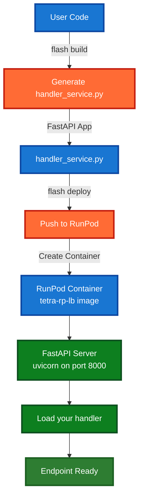
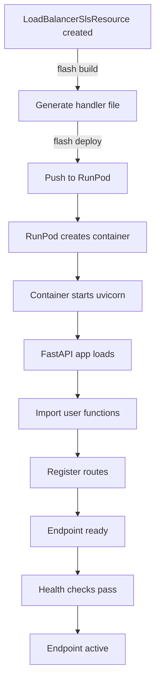
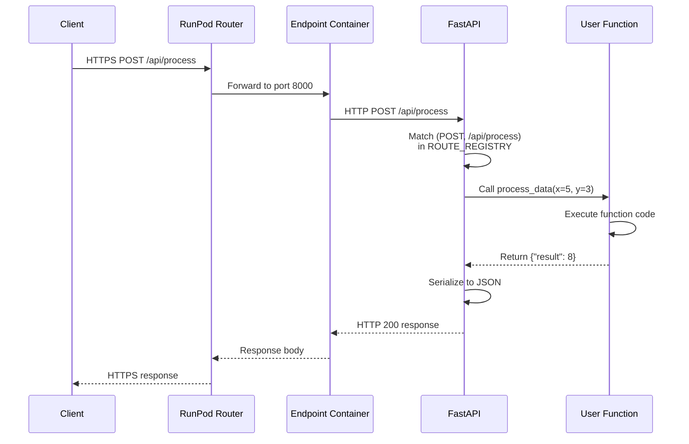
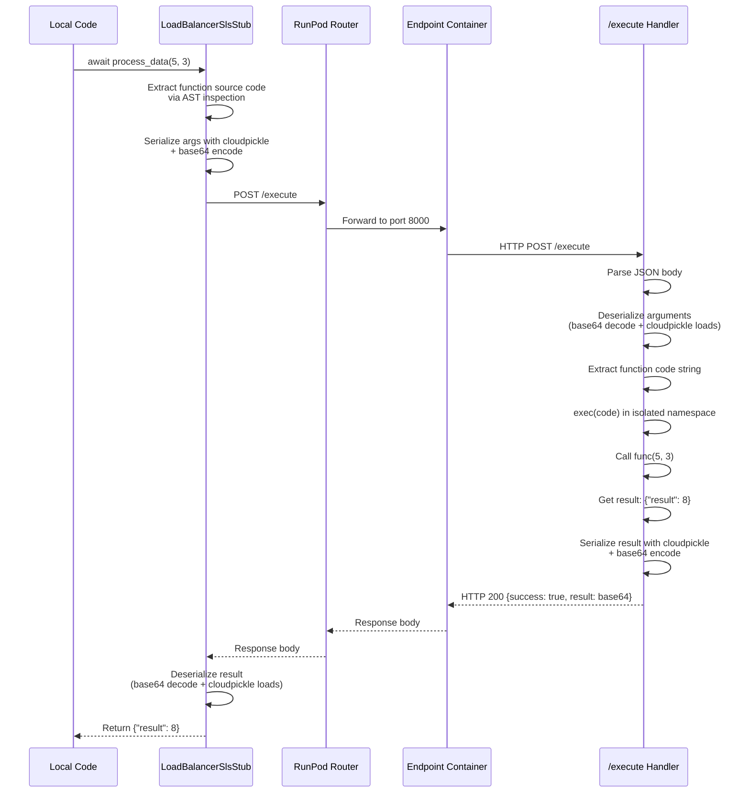
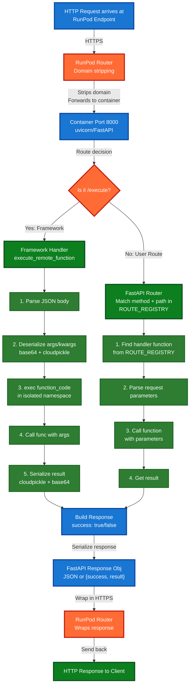
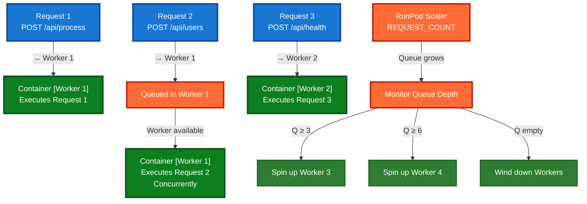

# Load-Balanced Endpoint Runtime Architecture

## Overview

This document explains what happens after a load-balanced endpoint is deployed on RunPod and is actively running. It covers the deployment architecture, request flows, and execution patterns for both direct HTTP requests and @remote function calls.

## Deployment Architecture

### Container Image and Startup

When you deploy a `LoadBalancerSlsResource` endpoint with `flash build` and `flash deploy`:



**Important:** `endpoint_url` is auto-generated by RunPod after deployment
- Cannot be specified by users
- Generated as: `https://<runpod-base>/<endpoint-id>`
- Automatically populated in the resource after `deploy()` completes
- Available via `resource.endpoint_url` property (read-only)

### What Gets Deployed

The generated handler file contains:

```python
# handler_service.py (auto-generated)
from fastapi import FastAPI
from tetra_rp.runtime.lb_handler import create_lb_handler

# User functions imported
from api.endpoints import process_data
from api.health import health_check

# Route registry
ROUTE_REGISTRY = {
    ("POST", "/api/process"): process_data,
    ("GET", "/api/health"): health_check,
}

# FastAPI app created
app = create_lb_handler(ROUTE_REGISTRY)

if __name__ == "__main__":
    import uvicorn
    uvicorn.run(app, host="0.0.0.0", port=8000)
```

**Container Setup:**
- Base image: `runpod/tetra-rp-lb:latest` (contains FastAPI, uvicorn, dependencies)
- Entrypoint: Runs `python handler_service.py`
- Port: 8000 (internal)
- RunPod exposes this via HTTPS endpoint URL
- Health check: Polls `/ping` endpoint every 30 seconds with 15 second timeout per check
- All HTTP requests to the endpoint include authentication via `RUNPOD_API_KEY` environment variable (if set)

### Deployment Lifecycle



## Request Flow

### Direct HTTP Request (User Routes)

When a client makes an HTTP request to your deployed endpoint:



**Example Flow:**

```python
# User code
@remote(api, method="POST", path="/api/process")
async def process_data(x: int, y: int):
    return {"result": x + y}

# Client request
POST https://my-endpoint.runpod.ai/api/process
Content-Type: application/json
{"x": 5, "y": 3}

# On RunPod:
# 1. Request arrives at container port 8000
# 2. FastAPI receives POST /api/process
# 3. FastAPI parses JSON body: {"x": 5, "y": 3}
# 4. FastAPI calls process_data(x=5, y=3)
# 5. Function executes: returns {"result": 8}
# 6. FastAPI serializes response
# 7. Returns HTTP 200 with body {"result": 8}
# 8. RunPod wraps in HTTPS response
# 9. Client receives response
```

### @remote Function Call (Framework Endpoint)

When you call an `@remote` decorated function from your local code:



**Example Flow:**

```python
# Local code - after deployment
api = LoadBalancerSlsResource(name="user-service",
                            imageName="runpod/tetra-rp-lb:latest")

# Deploy the endpoint (generates endpoint_url automatically)
await api.deploy()
# After deploy, api.endpoint_url is populated by RunPod
# Example: "https://xxx-yyy-zzz.runpod.io"

@remote(api, method="POST", path="/api/process")
async def process_data(x: int, y: int):
    return {"result": x + y}

# Call the function locally
result = await process_data(5, 3)

# What happens:
# 1. Decorator finds LoadBalancerSlsStub in registry
# 2. Stub extracts function source code via AST
# 3. Stub serializes arguments: cloudpickle.dumps([5, 3])
# 4. Stub POST to https://my-endpoint.runpod.ai/execute
# 5. Container receives request at /execute endpoint
# 6. create_lb_handler's execute_remote_function handles it:
#    a. Parses JSON body
#    b. Deserializes arguments: [5, 3]
#    c. Executes: exec(function_code) in isolated namespace
#    d. Calls func(5, 3)
#    e. Gets result: {"result": 8}
#    f. Serializes result via cloudpickle
#    g. Returns {success: true, result: base64_string}
# 7. Stub deserializes result
# 8. Returns {"result": 8} to caller
```

## Deployment Execution Model

### Local Development (LiveLoadBalancer)

When using `LiveLoadBalancer` for local testing, endpoints expose two types of routes:

1. **User-Defined Routes** (e.g., `/api/health`, `/api/users`)
   - Called via direct HTTP requests
   - Called via `@remote` decorator (uses /execute internally)

2. **Framework Endpoints**
   - `/execute` - Accepts serialized function code for @remote execution
   - `/ping` - Health check endpoint

### Deployed Endpoints (LoadBalancerSlsResource)

When deployed to production, endpoints **only expose user-defined routes** for security:

1. **User-Defined Routes** (e.g., `/api/health`, `/api/users`)
   - Called via direct HTTP requests from clients
   - Called via `@remote` decorator (stub translates to HTTP requests to user routes)
   - `/execute` endpoint NOT exposed (removed for security)

2. **Framework Endpoints**
   - `/ping` - Health check endpoint only

### Request Handling by Execution Type

#### Direct HTTP Requests (Always Works)

```
GET  /health
POST /api/users
PUT  /api/users/{user_id}
DELETE /api/users/{user_id}
```

**Characteristics:**
- Called by external HTTP clients
- FastAPI handles routing automatically
- Standard HTTP request/response
- No serialization/deserialization
- Direct function execution
- Errors return HTTP error codes

**Example:**
```python
@remote(api, method="GET", path="/health")
def health_check():
    return {"status": "ok"}

# Client can call:
GET https://my-endpoint.runpod.ai/health
# Response: 200 OK {"status": "ok"}
```

#### @remote Function Calls (Different Local vs Deployed)

**Local (LiveLoadBalancer):**
```python
@remote(api, method="POST", path="/api/process")
async def process_data(x: int, y: int):
    return {"result": x + y}

# Called via @remote:
result = await process_data(5, 3)  # Uses /execute internally (local only)
```

**Deployed (LoadBalancerSlsResource):**
```python
@remote(api, method="POST", path="/api/process")
async def process_data(x: int, y: int):
    return {"result": x + y}

# Called via @remote:
result = await process_data(5, 3)
# Stub automatically translates to: POST /api/process {"x": 5, "y": 3}
# No /execute endpoint involved (security)
```

**Key Differences:**
- Local: Serializes function code, POSTs to /execute
- Deployed: Maps arguments to JSON, POSTs to user-defined route
- No code changes needed - stub handles both automatically

**Important Implementation Detail: Stub Decision Logic**

The stub determines which execution path to use by checking:
1. Is this a `LiveLoadBalancer`? → Always use `/execute` for local development
2. Does the function have `method` and `path` metadata from `@remote` decorator? → If yes, use user-defined route
3. If routing metadata is incomplete or missing → Falls back to `/execute` (will fail on deployed endpoints)

This means if you decorate a function for `LoadBalancerSlsResource` without specifying both `method` and `path`, the stub will attempt to use `/execute`, which doesn't exist in production. Always provide complete routing metadata for deployed endpoints.

**Important Implementation Detail: Parameter Mapping**

When using user-defined routes (deployed endpoints), the stub inspects the function signature and maps positional and keyword arguments to the HTTP request JSON body:

```python
@remote(api, method="POST", path="/api/process")
async def process_data(x: int, y: int):
    return {"result": x + y}

# Local call:
result = await process_data(5, 3)

# Gets translated to:
POST /api/process
{
  "x": 5,
  "y": 3
}
```

The stub uses Python's `inspect.signature()` to map positional args to parameter names. This requires that:
- Function parameters are JSON-serializable types (int, str, bool, list, dict, None)
- Function signature is available (defined at module level, not dynamically created)
- No complex types (custom classes, Request objects, etc.) are used as parameters

## Execution Flow Diagram



## Security Model at Runtime

### /execute Endpoint

The `/execute` endpoint is an internal framework endpoint that:

1. **Accepts arbitrary Python code** (serialized as string)
2. **Executes it** in an isolated namespace using Python's `exec()`
3. **Returns results** back to caller

**Critical Security Model:**

The `/execute` endpoint is **only exposed on `LiveLoadBalancer` for local development**. It is **explicitly removed from deployed `LoadBalancerSlsResource` endpoints** for security reasons.

**Why This Design Is Necessary:**

The `/execute` endpoint accepts and executes arbitrary Python code sent in HTTP requests. An unauthorized user with access to this endpoint could:
- Execute system commands (e.g., `os.system()`)
- Access file system data (e.g., read environment variables, credentials)
- Modify application state or data
- Use your infrastructure for malicious purposes

**Why This Is Secure When Used Correctly:**

- In `LiveLoadBalancer` (local development): Code originates from your own `@remote` decorator
- You control what function code is serialized and sent
- Only accessible during local testing, never exposed publicly
- Same trusted-client model as queue-based serverless endpoints

**What Happens When Deployed:**

```
LiveLoadBalancer (local):
- /execute endpoint: INCLUDED (for @remote function execution)
- User routes: Included
- Safe because: Only you can run your code locally

LoadBalancerSlsResource (deployed):
- /execute endpoint: REMOVED for security
- User routes: Included
- Safe because: No arbitrary code execution possible
```

**If /execute Was Exposed (Don't Do This):**

```python
# Attacker's request
POST https://my-endpoint.runpod.ai/execute
{
  "function_name": "malicious",
  "function_code": "import os; os.system('rm -rf /')",
  "args": [],
  "kwargs": {}
}

# This would execute arbitrary system commands on your infrastructure
```

**Best Practices:**

- Never manually add `/execute` to deployed endpoints
- Use the default `create_lb_handler()` behavior (removes `/execute`)
- Always use `LoadBalancerSlsResource` for production (not `LiveLoadBalancer`)
- Test locally with `LiveLoadBalancer` first
- For debugging deployed endpoints, use container logs, not code injection

## Concurrency and Scaling

### How RunPod Handles Concurrent Requests



### Function Execution

- Each request executes in isolated context
- async functions execute with asyncio
- Multiple requests can process concurrently (with async)
- Synchronous functions block worker thread

**Example Concurrency:**

```python
@remote(api, method="POST", path="/api/process")
async def process_data(x: int):
    import time
    await asyncio.sleep(10)  # Simulate work
    return {"result": x}

# If 5 requests come in simultaneously:
# - Request 1: await asyncio.sleep(10) → Worker 1
# - Request 2: await asyncio.sleep(10) → Worker 1 (concurrent)
# - Request 3: await asyncio.sleep(10) → Worker 1 (concurrent)
# - Request 4: await asyncio.sleep(10) → Worker 2 (new worker)
# - Request 5: await asyncio.sleep(10) → Worker 2 (concurrent)
#
# All 5 complete in ~10s (concurrent within workers)
```

## Error Handling at Runtime

### Client Errors

```
POST https://endpoint.runpod.ai/api/users
{"invalid": "json"

# Response: 422 Unprocessable Entity
{
  "detail": [
    {
      "type": "json_error",
      "loc": ["body"],
      "msg": "JSON decode error"
    }
  ]
}
```

### Function Errors

```
@remote(api, method="POST", path="/api/users")
async def create_user(name: str):
    if not name:
        raise ValueError("Name required")
    return {"id": 1, "name": name}

# Call with invalid data:
POST https://endpoint.runpod.ai/api/users
{"name": ""}

# Response: 422 Validation Error or 500 Internal Error
# (depending on where error occurs)
```

### @remote Execution Errors

```python
# Local code
@remote(api, method="POST", path="/api/process")
async def process_data(x: int):
    raise RuntimeError("Processing failed")

result = await process_data(5)
# Raises RuntimeError: "Remote execution failed: Processing failed"
```

## Performance Characteristics

### Request Latency (approximate)

```
Direct HTTP Request:
- Request → RunPod Router: 10-50ms
- FastAPI routing: 1-5ms
- Function execution: Variable
- Serialization: Variable
- Response: 10-50ms
Total (no-op function): 30-110ms

@remote Function Call:
- Function serialization: 1-10ms
- HTTP request to /execute: 10-50ms
- Deserialization: 1-10ms
- Function execution: Variable
- Result serialization: 1-10ms
- Result deserialization: 1-10ms
- Response: 10-50ms
Total (no-op function): 40-150ms
```

### Memory Usage

- FastAPI app baseline: ~50-100MB
- Per function in namespace: ~0.5-5MB
- Serialized args/result: Variable (depends on data size)
- RunPod allocates: Depends on pod type

### Request Size Limits

- RunPod has limits on request body size
- Serialized data (via cloudpickle) increases size
- Large arguments may hit limits
- Consider streaming for large payloads

## Monitoring and Debugging at Runtime

### Logs Available on RunPod

```
Container logs (uvicorn/FastAPI):
- Request arrival
- Route matching
- Function execution
- Errors and exceptions
- Response generation

Environment:
- Pod ID
- Worker ID
- GPU allocation
- Memory usage
```

### Health Checks

```
GET https://endpoint.runpod.ai/ping
Response: 200 OK {"status": "healthy"}

RunPod polls /ping every 30 seconds
- 200 OK → Worker healthy
- Non-200 → Worker unhealthy
- No response → Worker down
- Unhealthy workers replaced
```

### Common Issues at Runtime

**"Connection refused"**
- Container not running
- Uvicorn failed to start
- Check container logs

**"Timeout after 30s"**
- Function took >30s
- Network issue
- Increase timeout if needed

**"500 Internal Server Error"**
- Function raised exception
- Check container logs
- Verify function code

## Deployment Considerations

### Image Selection

```
tetra-rp-lb:latest (default)
- FastAPI + uvicorn pre-installed
- Tetra runtime dependencies
- Optimized for LB endpoints

Custom image:
- Must have FastAPI, uvicorn
- Must expose port 8000
- /ping endpoint should work
```

### Pod Configuration

```python
LoadBalancerSlsResource(
    name="my-api",
    imageName="runpod/tetra-rp-lb:latest",
    gpus=[GpuGroup.AMPERE_80],      # Optional: if compute needed
    instanceIds=[...],               # Or specify CPU instances
    workersMax=5,                    # Max concurrent workers
    template=PodTemplate(...)        # Storage, env vars, etc.
)
```

### Network

```
Incoming:
- HTTPS endpoint provided by RunPod
- Auto-scaled based on REQUEST_COUNT
- Health checks ensure availability

Outgoing:
- Your functions can make HTTP requests
- Can access external APIs
- Can access other RunPod endpoints
```

## Summary

**What Happens at Runtime:**

1. **Deployment** - FastAPI app runs in RunPod container
2. **Request Arrival** - HTTP request reaches container
3. **Routing** - FastAPI matches method/path to function
4. **Execution** - Function code runs with parameters
5. **Response** - Result serialized and returned

**Two Execution Paths:**

- **User Routes** - Direct HTTP from clients
- **Framework Routes** - @remote calls from local code via /execute

**Key Characteristics:**

- ✅ Low latency (direct HTTP)
- ✅ No queuing overhead
- ✅ Concurrent request handling
- ✅ FastAPI routing
- ✅ Serialized function execution via @remote

**Security:**

- Protect `/execute` endpoint with authentication
- Only allow @remote calls from trusted sources
- Monitor endpoint usage
