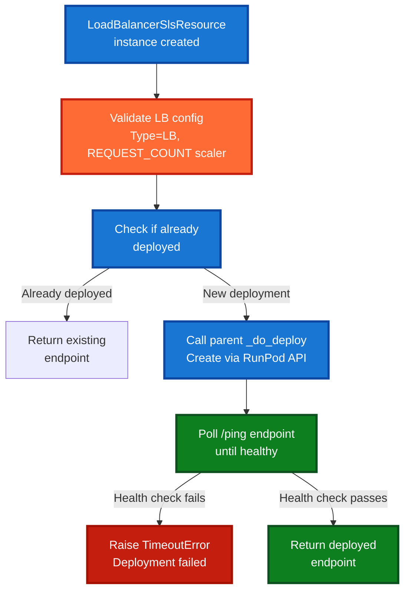
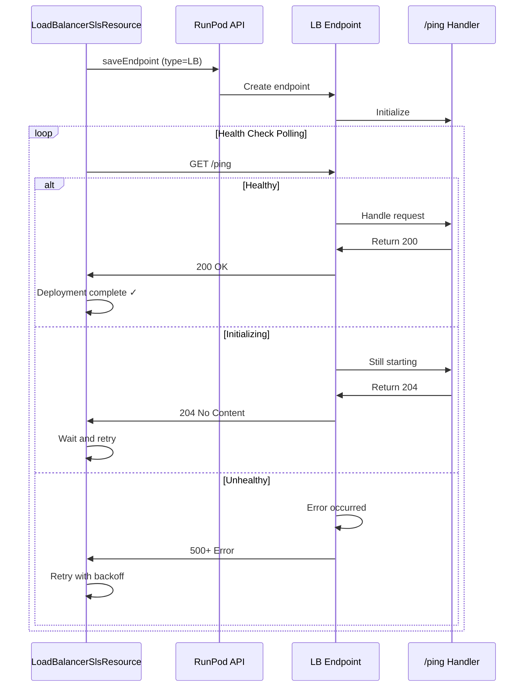

# Load-Balanced Serverless Endpoints

## Overview

The `LoadBalancerSlsResource` class enables provisioning and management of RunPod load-balanced serverless endpoints. Unlike queue-based endpoints that process requests sequentially, load-balanced endpoints expose HTTP servers directly to clients, enabling REST APIs, webhooks, and real-time communication patterns.

This resource type forms the foundation for the Mothership architecture, which requires HTTP-based endpoint discovery and cross-endpoint communication.

## Design Context

### Problem Statement

RunPod supports two serverless endpoint models:

1. **Queue-Based (QB)**: Sequential processing with automatic retry logic
   - Requests queued and processed one-at-a-time
   - Built-in error recovery
   - Higher latency but fault-tolerant
   - Fixed request/response format (JSON)

2. **Load-Balanced (LB)**: Direct HTTP routing to healthy workers
   - Requests routed directly to available workers
   - No automatic retries
   - Lower latency but less fault tolerance
   - Custom HTTP endpoints and protocols

### Design Decision

Load-balanced endpoints require different provisioning and health check logic than queue-based endpoints. `LoadBalancerSlsResource` extends `ServerlessResource` with LB-specific behavior:

- **Type enforcement**: Always deploys as LB (never QB)
- **Scaler validation**: Requires REQUEST_COUNT scaler (not QUEUE_DELAY)
- **Health checks**: Polls `/ping` endpoint to verify worker availability
- **Post-deployment verification**: Waits for endpoint readiness before returning

### Why This Matters

The Mothership needs to serve as a manifest server for child endpoints. This requires:
- HTTP-based service discovery (not queue-based)
- Ability to expose custom endpoints (`/manifest`, `/ping`)
- Health checking to verify children are ready before routing traffic

## Architecture

### High-Level Flow



### Configuration Hierarchy

```
ServerlessResource (base class)
├── type: ServerlessType = QB (queue-based)
├── scalerType: ServerlessScalerType = QUEUE_DELAY
├── Standard provisioning flow
└── Standard health checks (RunPod SDK)

LoadBalancerSlsResource (LB-specific subclass)
├── type: ServerlessType = LB (always, cannot override)
├── scalerType: ServerlessScalerType = REQUEST_COUNT (required)
├── Enhanced provisioning flow
│   ├── Validation before deploy
│   └── Post-deployment health check polling
├── Async health check (_check_ping_endpoint)
├── Sync health check (is_deployed)
└── Health check polling (_wait_for_health)
```

### Health Check Mechanism

Load-balanced endpoints require a `/ping` endpoint that responds with:
- **200 OK**: Worker is healthy and ready
- **204 No Content**: Worker is initializing (transient)
- **Other status**: Worker is unhealthy



## Using @remote with LoadBalancer Endpoints

This document focuses on the `LoadBalancerSlsResource` class implementation and architecture.

**Related documentation:**
- [Using @remote with Load-Balanced Endpoints](Using_Remote_With_LoadBalancer.md) - User guide for writing and testing load-balanced endpoints
- [LoadBalancer Runtime Architecture](LoadBalancer_Runtime_Architecture.md) - Technical details on what happens when deployed on RunPod, request flows, and execution patterns

**In the user guide, you'll learn:**
- Quick start with `LiveLoadBalancer` for local development
- HTTP routing with `method` and `path` parameters
- Building and deploying load-balanced endpoints
- Complete working examples
- Troubleshooting common issues

**In the runtime architecture guide, you'll learn:**
- Deployment architecture and container setup
- Request flow for both direct HTTP and @remote calls
- Dual endpoint model (/execute vs user routes)
- Security considerations
- Performance characteristics and monitoring

## Usage

### Basic Provisioning

```python
from tetra_rp import LoadBalancerSlsResource

# Create a load-balanced endpoint
mothership = LoadBalancerSlsResource(
    name="mothership",
    imageName="my-mothership-app:latest",
    workersMin=1,
    workersMax=3,
    env={
        "FLASH_APP": "my_app",
        "LOG_LEVEL": "INFO",
    }
)

# Deploy endpoint
deployed = await mothership.deploy()

# Endpoint is now deployed and healthy
print(f"Endpoint ID: {deployed.id}")
print(f"Endpoint URL: {deployed.endpoint_url}")
```

### Configuration Options

```python
LoadBalancerSlsResource(
    # Required fields
    name="my-endpoint",
    imageName="my-image:latest",

    # Worker scaling (for LB, these control max concurrent requests)
    workersMin=1,           # Min number of workers to keep warm
    workersMax=5,           # Max workers to spin up
    scalerValue=10,         # Target concurrent requests per worker

    # Environment configuration
    env={
        "ENV_VAR": "value",
    },

    # Network and storage
    networkVolume=NetworkVolume(...),  # Optional: persistent storage

    # Deployment location
    datacenter=DataCenter.EU_RO_1,  # Or US_EAST_1, etc

    # Timeouts
    executionTimeoutMs=600000,  # 10 minute timeout
    idleTimeout=5,              # Seconds before scaling down
)
```

### Health Checks

```python
# Synchronous health check (for compatibility with RunPod SDK)
is_healthy = endpoint.is_deployed()

# Asynchronous health check (for deployment flow)
is_healthy = await endpoint.is_deployed_async()

# Direct ping check (for debugging)
is_responding = await endpoint._check_ping_endpoint()

# Health check polling with custom parameters
healthy = await endpoint._wait_for_health(
    max_retries=20,
    retry_interval=3,  # seconds
)
```

## Validation and Error Handling

### Configuration Validation

The resource validates LB-specific constraints at creation and deployment time:

```python
# This will fail at validation time
try:
    bad_endpoint = LoadBalancerSlsResource(
        name="test",
        imageName="test:latest",
        scalerType=ServerlessScalerType.QUEUE_DELAY,  # Not allowed for LB!
    )
    await bad_endpoint.deploy()
except ValueError as e:
    # Error: LoadBalancerSlsResource requires REQUEST_COUNT scaler,
    # not QUEUE_DELAY. Load-balanced endpoints don't support queue-based scaling.
    print(f"Validation failed: {e}")
```

### Deployment Errors

```python
try:
    endpoint = LoadBalancerSlsResource(
        name="mothership",
        imageName="my-image:latest",
    )
    deployed = await endpoint.deploy()
except TimeoutError as e:
    # Health check failed after max retries
    # Error: LB endpoint mothership (endpoint-id) failed to become
    # healthy within 60s
    print(f"Deployment failed: {e}")
except ValueError as e:
    # RunPod API error or configuration issue
    print(f"Deployment error: {e}")
```

## Type Safety

`LoadBalancerSlsResource` enforces LB type at the class level:

```python
# Type is always LB, cannot be changed
endpoint = LoadBalancerSlsResource(
    name="test",
    imageName="image",
    type=ServerlessType.QB,  # This gets overridden!
)

assert endpoint.type == ServerlessType.LB  # Always LB
```

## Performance Characteristics

### Deployment Timeline

| Phase | Duration | Notes |
|-------|----------|-------|
| API call | < 1s | RunPod endpoint creation |
| Worker initialization | 30-60s | Endpoint starts up |
| Health check polling | 5-50s | Depends on app startup time (10 retries × 5s = 50s max) |
| **Total** | **35-110s** | Typical: 60-90s |

### Health Check Polling

```
Attempt 1: GET /ping → No response (endpoint starting)
  Wait 5s
Attempt 2: GET /ping → 204 No Content (initializing)
  Wait 5s
Attempt 3: GET /ping → 200 OK (healthy) ✓
  Deployment complete
```

Default configuration:
- Max retries: 10
- Retry interval: 5 seconds
- Timeout per request: 5 seconds
- Total timeout: ~50 seconds

## Comparison with Standard Endpoints

| Feature | Queue-Based (QB) | Load-Balanced (LB) |
|---------|------------------|-------------------|
| Request model | Sequential queue | Direct HTTP routing |
| Retries | Automatic | Manual (client) |
| Latency | Higher (queuing) | Lower (direct) |
| Custom endpoints | Limited | Full HTTP support |
| Scalability | Per-function | Per-worker |
| Health checks | RunPod SDK | `/ping` endpoint |
| Use cases | Batch processing | APIs, webhooks, real-time |
| Suitable for | Workers | Mothership, services |

## Implementation Details

### Code Structure

```
LoadBalancerSlsResource (class)
├── __init__(...)
│   └── Enforce type=LB, scalerType=REQUEST_COUNT
├── _validate_lb_configuration()
│   └── Check scaler type, type field
├── is_deployed_async()
│   ├── Check endpoint ID
│   └── Call _check_ping_endpoint()
├── _check_ping_endpoint()
│   ├── GET /ping endpoint
│   └── Check status 200 or 204
├── _wait_for_health(max_retries, retry_interval)
│   ├── Loop polling
│   ├── Exponential backoff
│   └── Return after success or timeout
├── _do_deploy()
│   ├── Call _validate_lb_configuration()
│   ├── Call parent _do_deploy()
│   ├── Call _wait_for_health()
│   └── Return deployed resource or raise TimeoutError
└── is_deployed()
    └── Sync wrapper using RunPod SDK
```

### Thread Safety

- `is_deployed()` is thread-safe (uses RunPod SDK)
- Async methods are safe for concurrent use
- Health check polling handles multiple concurrent calls

## Troubleshooting

### Health Check Timeout

**Problem**: Deployment times out at health check step

**Causes**:
- Endpoint failed to start (wrong image, runtime error)
- `/ping` endpoint not implemented
- `/ping` endpoint not responding within timeout
- Firewall/network blocking requests

**Solution**:
- Verify image exists and runs correctly: `docker run my-image:latest`
- Implement `/ping` endpoint that returns 200 OK
- Check logs: `runpod-cli logs <endpoint-id>`
- Increase timeout: `await endpoint._wait_for_health(max_retries=20)`

### Configuration Validation Errors

**Problem**: `ValueError: LoadBalancerSlsResource requires REQUEST_COUNT scaler`

**Cause**: Scaler type set to QUEUE_DELAY

**Solution**:
```python
# Remove scalerType specification (defaults to REQUEST_COUNT)
endpoint = LoadBalancerSlsResource(
    name="test",
    imageName="image",
    # scalerType NOT specified, defaults to REQUEST_COUNT
)
```

### API Errors (401, 403, 429)

**Problem**: RunPod GraphQL errors during deployment

**Causes**:
- Missing or invalid RUNPOD_API_KEY
- Insufficient permissions
- Rate limiting

**Solution**:
- Verify API key: `echo $RUNPOD_API_KEY`
- Check RunPod dashboard permissions
- Retry after delay for rate limits

## Next Steps

- **Mothership integration**: Use LoadBalancerSlsResource for Mothership endpoints
- **Service discovery**: Implement `/manifest` endpoint for child endpoint discovery
- **Auto-provisioning**: Automatic child endpoint deployment on Mothership startup
- **Cross-endpoint routing**: Route requests between endpoints using service discovery
