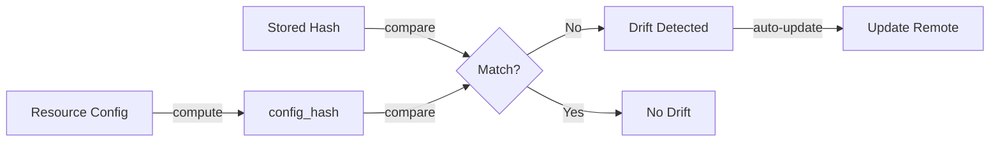

# Resource Config Drift Detection

Automatic detection and fixing of configuration drift between local resource definitions and remote RunPod endpoints.

## Overview

When you save a resource configuration, Flash stores a hash of your configuration. On subsequent deployments, Flash compares the current configuration hash with the stored one. If they differ, Flash automatically detects the drift and updates the remote endpoint.



## How It Works

### 1. Hash Computation

Each resource computes a hash excluding runtime-assigned fields:

```python
# File: src/runpod_flash/core/resources/serverless.py

RUNTIME_FIELDS: ClassVar[Set[str]] = {
    "template",           # Assigned by API
    "templateId",         # Assigned by API
    "aiKey",              # Assigned by API
    "userId",             # Assigned by API
    "createdAt",          # Assigned by API
    "activeBuildid",      # Assigned by API
    "computeType",        # Computed by API
    "hubRelease",         # Computed by API
    "repo",               # Computed by API
}

EXCLUDED_HASH_FIELDS: ClassVar[Set[str]] = {"id"}
```

The `config_hash` property:
- Excludes all RUNTIME_FIELDS
- Excludes EXCLUDED_HASH_FIELDS
- Computes MD5 hash of remaining fields
- Returns hex digest

```python
@property
def config_hash(self) -> str:
    """Get config hash excluding env and runtime-assigned fields."""
    exclude_fields = (
        self.__class__.RUNTIME_FIELDS | self.__class__.EXCLUDED_HASH_FIELDS
    )
    config_dict = self.model_dump(
        exclude_none=True, exclude=exclude_fields, mode="json"
    )
    config_str = json.dumps(config_dict, sort_keys=True)
    hash_obj = hashlib.md5(f"{resource_type}:{config_str}".encode())
    return hash_obj.hexdigest()
```

### 2. Drift Storage

When ResourceManager registers a resource, it stores the hash:

```python
# File: src/runpod_flash/core/resources/resource_manager.py

def _add_resource(self, uid: str, resource: DeployableResource):
    """Add a resource to the manager."""
    self._resources[uid] = resource
    self._resource_configs[uid] = resource.config_hash  # Store hash
    self._save_resources()
```

### 3. Drift Detection

On subsequent deployments, ResourceManager detects drift:

```python
async def get_or_deploy_resource(self, config: DeployableResource):
    """Get or deploy resource, detecting drift automatically."""
    resource_key = config.get_resource_key()
    new_config_hash = config.config_hash

    existing = self._resources.get(resource_key)
    if existing:
        stored_config_hash = self._resource_configs.get(resource_key, "")

        if stored_config_hash != new_config_hash:
            # DRIFT DETECTED - automatically update
            log.info(
                f"Config drift detected for '{config.name}': "
                f"Automatically updating endpoint"
            )

            # Attempt update (will redeploy if structural changes detected)
            if hasattr(existing, "update"):
                updated_resource = await existing.update(config)
                self._add_resource(resource_key, updated_resource)
                return updated_resource
```

## CPU LoadBalancer Special Case

CPU LoadBalancers have a customized hash that includes only CPU-relevant fields:

```python
# File: src/runpod_flash/core/resources/load_balancer_sls_resource.py

@property
def config_hash(self) -> str:
    """Get hash of CPU-relevant fields only (excludes GPU fields)."""
    cpu_fields = {
        "datacenter",
        "flashboot",
        "imageName",
        "networkVolume",
        "instanceIds",      # CPU instance type
        "workersMin",       # Scaling
        "workersMax",       # Scaling
        "scalerType",       # Scaling policy
        "scalerValue",      # Scaling policy
        "type",             # LB vs QB
        "idleTimeout",      # Timeout
        "executionTimeoutMs",  # Timeout
        "locations",        # Deployment region
    }
    config_dict = self.model_dump(
        exclude_none=True, include=cpu_fields, mode="json"
    )
    # ... hash computation
```

**Why?** CPU endpoints don't use GPU fields (gpuCount, gpuIds, allowedCudaVersions), so those changes shouldn't trigger drift. Only CPU-specific config fields are hashed.

## Usage

### Basic Deployment with Auto Drift Detection

```python
from runpod_flash import CpuLoadBalancerSlsResource

# Define resource
lb = CpuLoadBalancerSlsResource(
    name="inference-lb",
    imageName="user/image:1.0",
    workersMin=2,
    workersMax=5
)

# First deploy
resource = await ResourceManager.get_or_deploy_resource(lb)
# Hash stored: abc123...

# Change configuration
lb = CpuLoadBalancerSlsResource(
    name="inference-lb",
    imageName="user/image:2.0",  # Changed!
    workersMin=2,
    workersMax=5
)

# Second deploy - drift detected automatically
resource = await ResourceManager.get_or_deploy_resource(lb)
# Detects: stored hash != new hash
# Automatically updates remote endpoint
```

## Fields That Trigger Drift

These user-configured fields affect the hash. For GPU resources, all fields in `_hashed_fields` are compared. For CPU LoadBalancers, only these CPU-relevant fields are hashed:

| Field | Example | GPU | CPU-LB | Impact |
|-------|---------|-----|--------|--------|
| `imageName` | "user/image:1.0" | ✓ | ✓ | Runtime behavior |
| `workersMin` | 2 | ✓ | ✓ | Scaling: minimum workers |
| `workersMax` | 5 | ✓ | ✓ | Scaling: maximum workers |
| `scalerType` | REQUEST_COUNT | ✓ | ✓ | Scaling policy |
| `scalerValue` | 4 | ✓ | ✓ | Scaling value |
| `locations` | "eu-ro-1" | ✓ | ✓ | Deployment region |
| `datacenter` | EU_RO_1 | ✓ | ✓ | Data center |
| `type` | LB | ✓ | ✓ | QB (queue) vs LB (load-balancer) |
| `idleTimeout` | 5 | ✓ | ✓ | Worker idle timeout (seconds) |
| `executionTimeoutMs` | 600000 | ✓ | ✓ | Job execution timeout (ms) |
| `flashboot` | True | ✓ | ✓ | Enable Flashboot |
| `networkVolume` | Volume() | ✓ | ✓ | Network storage |
| `instanceIds` | [CPU3G_1_4] | ✗ | ✓ | CPU instance type (CPU only) |
| `gpuIds` | "L40" | ✓ | ✗ | GPU type (GPU only) |
| `gpuCount` | 1 | ✓ | ✗ | GPU count (GPU only) |
| `allowedCudaVersions` | "12.0" | ✓ | ✗ | CUDA version (GPU only) |
| `name` | "my-endpoint" | ✗ | ✗ | NOT hashed (identity only) |

## Fields Ignored (No Drift)

These changes don't trigger drift:

| Field | Why Ignored |
|-------|------------|
| `template` | Assigned by RunPod API |
| `templateId` | Assigned by RunPod API |
| `aiKey` | Assigned by RunPod API |
| `userId` | Assigned by RunPod API |
| `createdAt` | Timestamp |
| `activeBuildid` | Computed by API |
| `env` | Dynamically computed from .env |
| `id` | Immutable identifier |

## Testing

All drift behavior is tested in `tests/unit/resources/test_load_balancer_drift.py`:

```python
def test_lb_config_hash_unchanged_with_same_config():
    """Same configuration produces same hash."""
    lb1 = LoadBalancerSlsResource(name="test-lb", imageName="test/image:latest")
    lb2 = LoadBalancerSlsResource(name="test-lb", imageName="test/image:latest")
    assert lb1.config_hash == lb2.config_hash

def test_lb_config_hash_excludes_template_field():
    """Template object changes don't affect hash."""
    lb1 = LoadBalancerSlsResource(name="test-lb", imageName="test/image:latest")
    hash1 = lb1.config_hash

    lb1.template = PodTemplate(imageName="test/image:latest", name="test")
    hash_after = lb1.config_hash

    assert hash1 == hash_after  # No drift

def test_lb_config_hash_detects_image_change():
    """Image changes DO affect hash."""
    lb1 = LoadBalancerSlsResource(name="test-lb", imageName="test/image:v1")
    lb2 = LoadBalancerSlsResource(name="test-lb", imageName="test/image:v2")
    assert lb1.config_hash != lb2.config_hash  # Drift detected

def test_cpu_lb_config_hash_excludes_gpu_fields():
    """GPU field values don't affect CPU load balancer hash."""
    cpu_lb1 = CpuLoadBalancerSlsResource(
        name="test-cpu-lb",
        imageName="test/image:latest",
        instanceIds=[CpuInstanceType.CPU3G_1_4],
    )
    hash1 = cpu_lb1.config_hash

    cpu_lb1.gpuCount = 4  # Set GPU field
    hash2 = cpu_lb1.config_hash

    assert hash1 == hash2  # No drift
```

## Implementation Details

### Field List Maintenance

When adding new fields to ServerlessResource, evaluate:

1. **Is it user-specified config?** → Include in hash
2. **Is it API-assigned/runtime?** → Add to RUNTIME_FIELDS
3. **Is it dynamically computed?** → Already excluded

Example:
```python
# Adding new field 'maxConcurrency'
# 1. It's user-specified? YES
# 2. Add to _hashed_fields
# 3. Test that changes trigger drift
# 4. Test that setting it doesn't cause false positives
```

### Enum Serialization Safety

Enum fields are defensively serialized to handle pre-stringified values:

```python
@field_serializer("scalerType")
def serialize_scaler_type(self, value: Optional[ServerlessScalerType]) -> Optional[str]:
    """Handle both enum instances and pre-stringified values."""
    if value is None:
        return None
    return value.value if isinstance(value, ServerlessScalerType) else value
```

This prevents false drift from external systems that pre-stringify enum values.

## Performance

Hash computation is fast (milliseconds):
- Excludes large fields (env is excluded)
- Only computed when needed
- Cached by ResourceManager

Example timing:
- `config_hash` computation: ~1ms
- Drift comparison: <1ms
- Full deployment cycle: 5-30s (dominated by API calls, not hashing)

## Troubleshooting

### False Positives (Drift detected when shouldn't be)

**Check:** Have you added a new runtime-assigned field?

```python
# If you added a field that's assigned by the API:
class ServerlessResource:
    RUNTIME_FIELDS: ClassVar[Set[str]] = {
        # ... existing fields ...
        "myNewField",  # Add here if API-assigned
    }
```

**Check:** Enum serializers working?

```python
# Verify field_serializers handle both enum and string
@field_serializer("myEnumField")
def serialize_field(self, value):
    if value is None:
        return None
    return value.value if isinstance(value, MyEnum) else value
```

### Missing Drift Detection

**Check:** Is the field in `_hashed_fields`?

```python
class ServerlessResource:
    _hashed_fields = {
        # ... existing fields ...
        "myNewField",  # Add here if should trigger drift
    }
```

**Check:** Is the hash computation including your field?

```python
# CPU LoadBalancer has custom hash - includes only CPU fields
cpu_fields = {
    "datacenter",
    "flashboot",
    "imageName",
    "gpus",
    "networkVolume",
}
# GPU fields like gpuCount excluded
```

## Related Files

- **Implementation:** `src/runpod_flash/core/resources/serverless.py` (config_hash)
- **CPU Variant:** `src/runpod_flash/core/resources/load_balancer_sls_resource.py` (config_hash override)
- **Resource Manager:** `src/runpod_flash/core/resources/resource_manager.py` (drift detection logic)
- **Tests:** `tests/unit/resources/test_load_balancer_drift.py` (42 tests)

---

Generated: 2026-01-04
Branch: `deanq/ae-1196-absolute-drift-detection`
