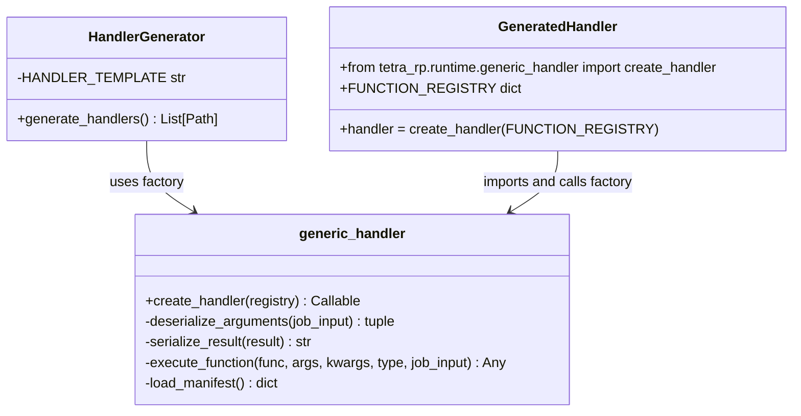
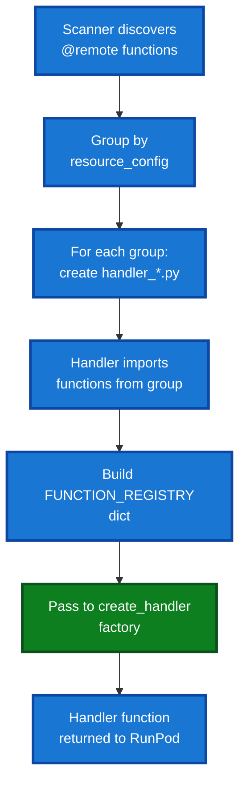

# Generic Handler Factory Architecture

## Overview

The `generic_handler` module provides a factory function that creates RunPod serverless handlers for Flash applications. This design eliminates code duplication across generated handler files while maintaining a clean separation between handler logic and handler configuration.

When Flash builds your application, it generates lightweight handler files that delegate to the `create_handler()` factory rather than duplicating handler logic in every handler file.

## Endpoint bootstrapping (artifact install)

deployed endpoints are expected to start with an empty `/app` and a build artifact (the `flash build` tarball, typically `archive.tar.gz`) staged on a mounted project volume.

at runtime startup, flash will:

- **find the build artifact**: it prefers `FLASH_BUILD_ARTIFACT_PATH`/`FLASH_BUILD_ARTIFACT` if set, otherwise it uses the canonical flash project path: `/root/.runpod/archive.tar.gz` (configurable via `FLASH_PROJECT_VOLUME_MOUNT`).
- **extract into `/app`**: it safely extracts the tarball into `/app` (with tar path traversal protection).
- **make `/app` importable**: it prepends `/app` to `sys.path` so the extracted local modules + deps can be imported.

this bootstrap runs automatically when `tetra_rp.runtime` is imported on runpod (guarded by `RUNPOD_POD_ID`/`RUNPOD_ENDPOINT_ID`). you can disable it with `FLASH_DISABLE_UNPACK=1`.

## Design Context

### Build System Requirement

Flash needs to generate serverless handlers for deployment to RunPod. Each `resource_config` group requires a separate handler file that:

1. Imports functions assigned to that resource
2. Registers them in a function registry
3. Provides a RunPod-compatible handler function

### Design Decision

The generic handler pattern uses a factory function that encapsulates all shared handler logic, eliminating code duplication across generated handler files.

### Benefits

- **Single Source of Truth**: All handler logic in one place (`generic_handler.py`)
- **Easier Maintenance**: Bug fixes and improvements require updating one module, not regenerating all projects
- **Consistency**: All handlers behave identically

## Architecture Design

### High-Level Flow


### Component Diagram



### Function Registry Pattern



## Implementation Details

### Core Function: create_handler()

```python
def create_handler(function_registry: Dict[str, Callable]) -> Callable:
    """Create a RunPod serverless handler with given function registry.

    Args:
        function_registry: Dict mapping function names to function/class objects

    Returns:
        Handler function compatible with runpod.serverless.start()
    """
```

The factory returns a synchronous handler function with signature:

```python
def handler(job: Dict[str, Any]) -> Dict[str, Any]:
    """RunPod serverless handler.

    Args:
        job: RunPod job dict with 'input' key containing:
            - function_name: Name of function to execute
            - execution_type: "function" or "class"
            - args: List of base64-encoded, cloudpickle-serialized arguments
            - kwargs: Dict of base64-encoded, cloudpickle-serialized keyword args
            - [optional] method_name: For class execution, method to call
            - [optional] method_args: Arguments to method call
            - [optional] method_kwargs: Keyword arguments to method call

    Returns:
        Dict with structure:
            - success: bool - Whether execution succeeded
            - result: str - Base64-encoded cloudpickle result (if success=True)
            - error: str - Error message (if success=False)
            - traceback: str - Full traceback (if success=False)
    """
```

### Helper Functions

#### deserialize_arguments()

```python
def deserialize_arguments(job_input: Dict[str, Any]) -> tuple[list, dict]:
    """Deserialize function arguments from job input.

    Handles base64-decoding and cloudpickle deserialization for both
    positional and keyword arguments.

    Args:
        job_input: Dict from RunPod job with optional 'args' and 'kwargs' keys

    Returns:
        Tuple of (args_list, kwargs_dict) ready for function call
    """
```

#### serialize_result()

```python
def serialize_result(result: Any) -> str:
    """Serialize function result for response.

    Handles cloudpickle serialization and base64 encoding to ensure
    the result can be transmitted back to client.

    Args:
        result: Return value from function (any pickleable Python object)

    Returns:
        Base64-encoded cloudpickle string safe for JSON transmission
    """
```

#### execute_function()

```python
def execute_function(
    func_or_class: Callable,
    args: list,
    kwargs: dict,
    execution_type: str,
    job_input: Dict[str, Any],
) -> Any:
    """Execute function or class method.

    Supports two execution types:

    1. "function": Direct function call with args/kwargs
    2. "class": Instantiate class with args/kwargs, then call method

    Args:
        func_or_class: Function or class to execute
        args: Positional arguments
        kwargs: Keyword arguments
        execution_type: Either "function" or "class"
        job_input: Full job input (used for method_name/method_args/method_kwargs)

    Returns:
        Result of execution

    Raises:
        Exception: If execution fails
    """
```

#### load_manifest()

```python
def load_manifest(manifest_path: Path | None = None) -> Dict[str, Any]:
    """Load flash_manifest.json with fallback search.

    Searches multiple locations in order:
    1. Provided path (if given)
    2. Current working directory
    3. Module directory
    4. Three levels up (legacy location)

    The manifest contains:
    - resources: Mapping of resource_config to function groups
    - function_registry: Flat list of all functions across all endpoints

    Used for cross-endpoint function discovery at runtime.

    Args:
        manifest_path: Optional explicit path to manifest file

    Returns:
        Manifest dictionary, or empty dict structure if not found
    """
```

## Design Decisions

### Factory Pattern over Inheritance

**Decision**: Use factory function instead of base class inheritance

**Rationale**:

- Functions are simpler than classes for this use case
- Reduces coupling between handler and factory
- Easier to test: factory tested independently, then verified in integration
- Handler files remain minimal (just imports, registry, factory call)

### CloudPickle + Base64 Serialization

**Decision**: Use cloudpickle for serialization and base64 for encoding

**Rationale**:

- CloudPickle handles arbitrary Python objects (functions, classes, lambdas)
- Base64 encoding ensures safe transmission over JSON (no binary data)
- Consistent with RunPod's serverless API expectations
- Matches existing pattern in live serverless implementation

### Manifest Loading in Generic Handler

**Decision**: Keep manifest loading in generic handler, not in generated handler

**Rationale**:

- Manifest is runtime requirement for service discovery
- Generated handlers don't need manifest (it's not embedded)
- Generic handler can load manifest if available for cross-endpoint calls
- Reduces generated handler complexity further

### Error Handling Strategy

**Decision**: Return structured error responses with traceback

**Rationale**:

- RunPod serverless expects (success: bool, result/error) response format
- Including full traceback aids debugging in production
- Errors are values, not exceptions (functional approach)
- Client receives complete error context for diagnostics

### Support for Both Execution Types

**Decision**: Handle both function and class execution in single handler

**Rationale**:

- Some use cases require stateful classes (e.g., model loaders)
- Class methods can be registered same as functions
- Single handler supports both patterns without duplication
- Execution type is specified per-call via `execution_type` parameter

## Usage Examples

### Simple Function Handler

```python
# Generated handler_gpu_config.py
from tetra_rp.runtime.generic_handler import create_handler
from workers.gpu import process_image, analyze_features

FUNCTION_REGISTRY = {
    "process_image": process_image,
    "analyze_features": analyze_features,
}

handler = create_handler(FUNCTION_REGISTRY)

if __name__ == "__main__":
    import runpod
    runpod.serverless.start({"handler": handler})
```

### Class Execution

```python
# Generated handler_preprocess_config.py
from tetra_rp.runtime.generic_handler import create_handler
from workers.cpu.preprocessor import DataPreprocessor

FUNCTION_REGISTRY = {
    "DataPreprocessor": DataPreprocessor,  # Class, not function
}

handler = create_handler(FUNCTION_REGISTRY)

# Usage from client:
# job = {
#     "input": {
#         "function_name": "DataPreprocessor",
#         "execution_type": "class",
#         "args": [base64_encoded_config],
#         "kwargs": {},
#         "method_name": "process",
#         "method_args": [base64_encoded_data],
#         "method_kwargs": {}
#     }
# }
# response = await handler(job)
```

### Multiple Functions in Registry

```python
# Generated handler_cpu_config.py
from tetra_rp.runtime.generic_handler import create_handler
from workers.cpu.utils import (
    validate_input,
    transform_data,
    format_output,
)

FUNCTION_REGISTRY = {
    "validate_input": validate_input,
    "transform_data": transform_data,
    "format_output": format_output,
}

handler = create_handler(FUNCTION_REGISTRY)

# All functions available at same endpoint
# Client chooses which function to call via function_name parameter
```

## Build Process Integration

### Handler Discovery and Scanning

The handler factory integrates into the Flash build pipeline:

1. **Scanner Phase**: `RemoteDecoratorScanner` uses Python AST to discover all `@remote` decorated functions
2. **Grouping Phase**: `ManifestBuilder` groups functions by their `resource_config` name
3. **Generation Phase**: `HandlerGenerator` creates `handler_<resource_name>.py` files
4. **Packaging Phase**: All files including `flash_manifest.json` bundled into `archive.tar.gz`

### Manifest Structure

```json
{
  "version": "1.0",
  "generated_at": "2026-01-03T10:00:00Z",
  "project_name": "my_app",
  "resources": {
    "gpu_config": {
      "resource_type": "LiveServerless",
      "handler_file": "handler_gpu_config.py",
      "functions": [
        {
          "name": "gpu_task",
          "module": "workers.gpu",
          "is_async": true,
          "is_class": false
        }
      ]
    },
    "cpu_config": {
      "resource_type": "CpuLiveServerless",
      "handler_file": "handler_cpu_config.py",
      "functions": [
        {
          "name": "preprocess",
          "module": "workers.cpu",
          "is_async": false,
          "is_class": false
        }
      ]
    }
  },
  "function_registry": {
    "gpu_task": "workers.gpu.gpu_task",
    "preprocess": "workers.cpu.preprocess"
  }
}
```

### Generated Handler Structure

Generated handler files are minimal wrappers that import functions and delegate to the factory:

```python
# handler_gpu_config.py
from tetra_rp.runtime.generic_handler import create_handler
from workers.gpu import gpu_task

FUNCTION_REGISTRY = {
    "gpu_task": gpu_task,
}

handler = create_handler(FUNCTION_REGISTRY)

if __name__ == "__main__":
    import runpod
    runpod.serverless.start({"handler": handler})
```

**Design Benefits**:

- Single source of truth: All handler logic in `generic_handler.py`
- Zero duplication: One implementation serves all resource configs
- Easy to maintain: Bug fixes update one module, benefit all handlers

## Testing Strategy

### Unit Tests (test_generic_handler.py)

Tests verify factory behavior in isolation:

1. **Serialization**: `cloudpickle.dumps()` and base64 encoding round-trip correctly
2. **Deserialization**: Arguments deserialized from base64/cloudpickle format
3. **Function Execution**: Simple functions execute with correct arguments
4. **Keyword Arguments**: Functions called with both positional and keyword args
5. **Class Execution**: Classes instantiated, methods called with arguments
6. **Error Handling**: Missing functions return error response
7. **Exception Handling**: Function exceptions caught, traceback included
8. **Multiple Registries**: Multiple functions coexist in single registry
9. **Complex Objects**: Arbitrary Python objects serialize/deserialize correctly
10. **Edge Cases**: Empty args, None results, missing optional parameters

**Coverage**: 19 unit tests covering all major paths

### Integration Tests (test_handler_generator.py)

Tests verify generated handlers work with factory:

1. **File Generation**: Handler files created with correct names
2. **Imports Included**: Generated files import required functions
3. **Registry Present**: FUNCTION_REGISTRY properly formatted
4. **Factory Import**: `create_handler()` imported from `generic_handler`
5. **Handler Creation**: Handler assigned via `handler = create_handler(FUNCTION_REGISTRY)`
6. **RunPod Start**: RunPod start call present and correct
7. **Multiple Resources**: Multiple handlers generated for multiple resource configs

**Coverage**: 7 integration tests verifying handler generation

### Manual Testing

Verification with example applications:

1. **Single Resource**: App with one `@remote` function
2. **Multiple Resources**: App with GPU and CPU endpoints
3. **Mixed Workers**: Functions and classes in same handler
4. **Cross-Endpoint Calls**: Functions calling other endpoints
5. **Deployment**: Handlers work when deployed to RunPod

## Performance Characteristics

### Runtime Overhead

**Factory Initialization**: Called once at module import time (negligible)

```python
# Factory called once:
handler = create_handler(FUNCTION_REGISTRY)

# Per-request overhead: zero
# Handler execution is efficient and direct
```

**Minimal Runtime Overhead**: The factory approach has minimal performance impact because:

- Factory called once at startup (not per-request)
- Returned handler function is lightweight and direct
- No additional indirection in the request execution path

## Future Enhancements (Not Yet Implemented)

### Potential Enhancements

1. **Async Handler Support**: Detect async functions and handle appropriately
2. **Input Validation**: Validate arguments against function signatures
3. **Middleware Support**: Pre/post-processing hooks for observability
4. **Rate Limiting**: Per-function rate limiting configuration
5. **Caching**: Result caching for expensive functions
6. **Metrics**: Built-in observability for function execution
7. **Monitoring Hooks**: Integration with observability platforms

### Extensibility Points

- `execute_function()` can be overridden for custom execution logic
- Factory pattern allows custom handler factories in future
- Response format designed for easy extension with additional fields
- Manifest structure supports future configuration options
